# Огляд централізованого управління Windows (Overview of Windows Central Management)

---

## Сторінка 1

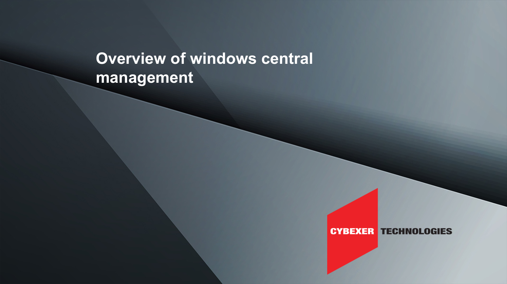

---

## Сторінка 2

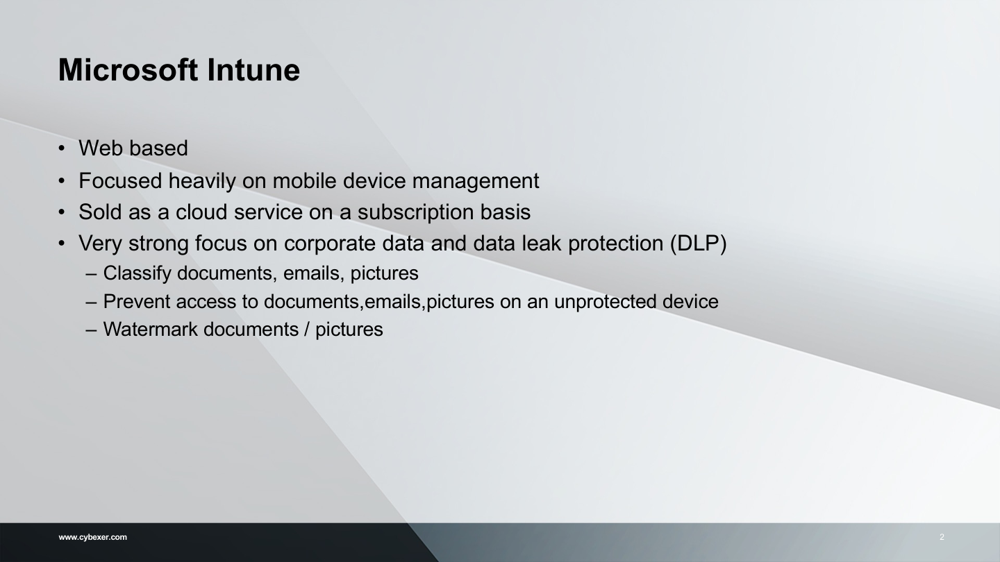

**Microsoft Intune**

- Веб-орієнтований
- Зосереджений переважно на управлінні мобільними пристроями (mobile device management)
- Продається як хмарний сервіс (cloud service) за підпискою
- Дуже сильний акцент на корпоративних даних і захисті від витоку даних (DLP — Data Leak Protection):
  - Класифікація документів, електронних листів, зображень
  - Запобігання доступу до документів, електронних листів, зображень на незахищеному пристрої
  - Нанесення водяних знаків (watermark) на документи / зображення

---

## Сторінка 3

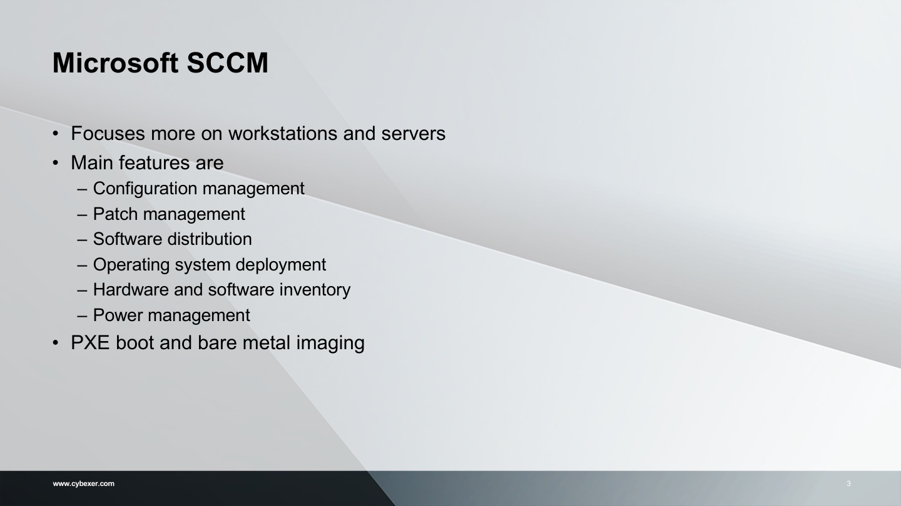

**Microsoft SCCM**

- Орієнтований більше на робочі станції (workstations) та сервери
- Основні функції:
  - Управління конфігурацією (configuration management)
  - Управління виправленнями (patch management)
  - Розповсюдження програмного забезпечення (software distribution)
  - Розгортання операційної системи (operating system deployment)
  - Апаратна та програмна інвентаризація (hardware and software inventory)
  - Управління живленням (power management)
- Завантаження по мережі (PXE boot) і розгортання «з нуля» (bare metal imaging)

---

## Сторінка 4

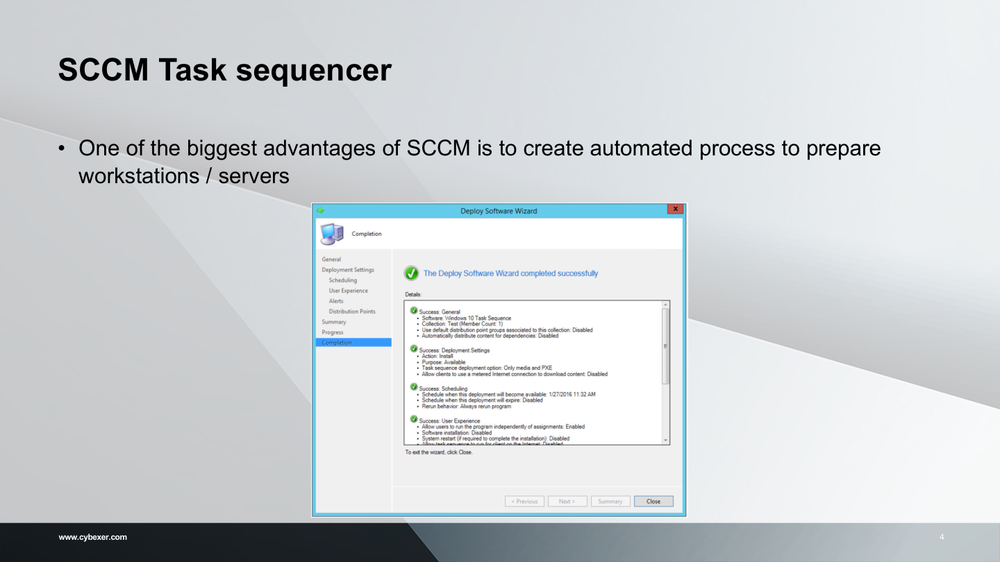

**Секвенсор завдань SCCM (SCCM Task Sequencer)**

- Одна з найбільших переваг SCCM — можливість створювати автоматизовані процеси підготовки робочих станцій / серверів

**«Автоматизовані процеси підготовки» (provisioning)** — означає:

- Замість того щоб вручну налаштовувати кожен комп'ютер/сервер, SCCM дозволяє описати конфігурацію один раз і автоматично розгортати її на сотні/тисячі машин
- Це включає: встановлення ОС, інсталяцію програм, налаштування політик, оновлення

**Практичний приклад:**
Потрібно розгорнути 500 робочих станцій з Windows 11 + Office + антивірус. Без SCCM — це тижні ручної роботи. З SCCM — адміністратор створює task sequence (послідовність завдань), і всі машини налаштовуються автоматично за одну ніч.

**Ключові механізми SCCM для цього:**
- **OSD (OS Deployment)** — автоматична установка ОС
- **Task Sequences** — сценарії підготовки крок за кроком
- **PXE Boot** — завантаження по мережі без фізичних носіїв

---

## Сторінка 5

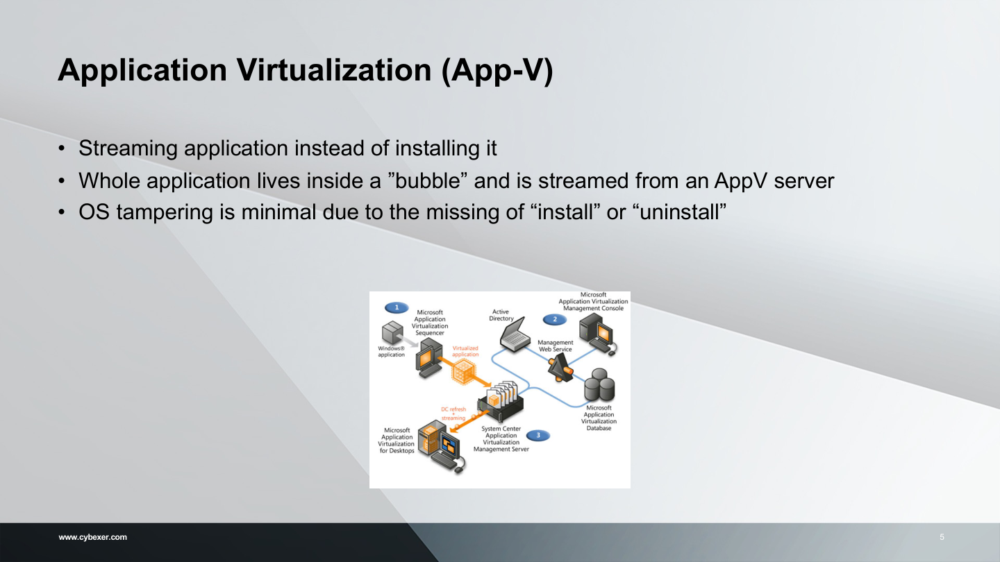

**Віртуалізація застосунків (Application Virtualization — App-V)**

- Потокове передавання застосунку (streaming application) замість його встановлення
- Весь застосунок існує всередині «бульбашки» (bubble) та передається потоком із сервера AppV
- Мінімальний вплив на ОС (OS tampering) через відсутність процесів «встановлення» (install) або «видалення» (uninstall)

**Основна ідея:**
Застосунок **не встановлюється** на комп'ютер у звичайному сенсі — він існує в ізольованому середовищі («бульбашці») і передається з сервера по мережі.

**Аналогія:** Як стрімінг відео (Netflix) — фільм не завантажується повністю, а передається потоком. App-V робить те саме із застосунками.

**Що таке «бульбашка» (bubble)?**

Ізольований контейнер, всередині якого застосунок:
- «думає», що встановлений на комп'ютері
- має свій власний реєстр (registry)
- має свої власні файли та бібліотеки
- **не взаємодіє з іншими застосунками та ОС**

**Переваги:**

| Звичайне встановлення | App-V |
|---|---|
| Змінює реєстр, системні файли | Нічого не змінює в ОС |
| Конфлікти між застосунками | Кожен в ізольованій бульбашці |
| Видалення залишає «сміття» | Видалення = просто прибрати потік |
| Треба встановлювати на кожній машині | Один сервер → всі машини |

**Практичний приклад:**
У компанії є два відділи: бухгалтерія потребує **Excel 2016**, розробники — **Excel 2021**. На одному комп'ютері дві версії конфліктують. З App-V — кожна версія у своїй бульбашці, без конфліктів.

**Ключові компоненти:**
- **App-V Server** — зберігає та роздає застосунки
- **App-V Client** — на кожній робочій станції, отримує потік
- **Sequencer** — «пакує» застосунок у формат App-V

**Головна перевага для адміністратора:** Оновив застосунок на сервері — всі користувачі автоматично отримали нову версію, без обходу кожного комп'ютера.

---

## Сторінка 6


# ACTIVE DIRECTORY (Активна директорія)

---

## Сторінка 7

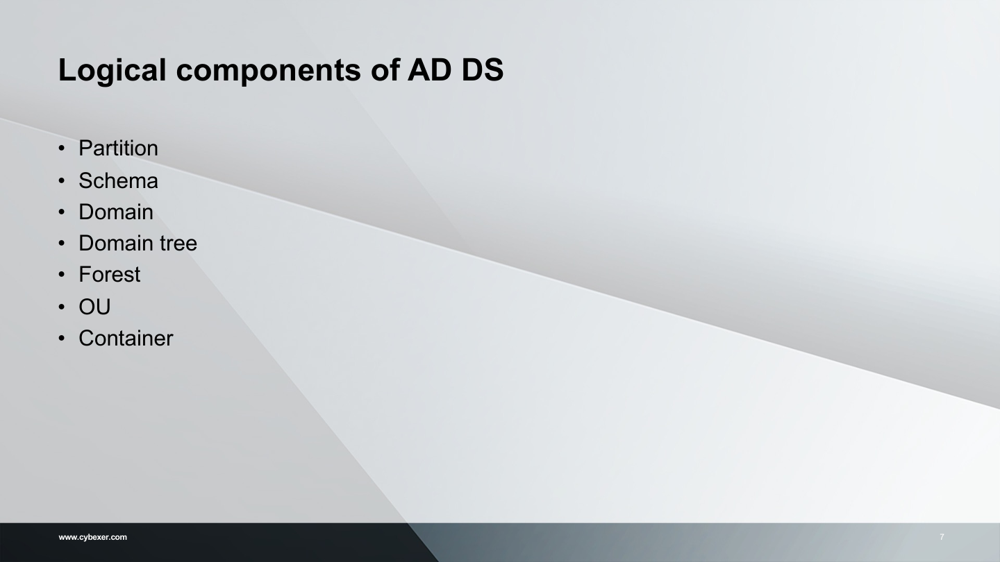

**Логічні компоненти AD DS (Logical Components of AD DS)**

- Розділ (Partition)
- Схема (Schema)
- Домен (Domain)
- Дерево доменів (Domain tree)
- Ліс (Forest)
- Організаційний підрозділ (OU — Organizational Unit)
- Контейнер (Container)

---

## Сторінка 8

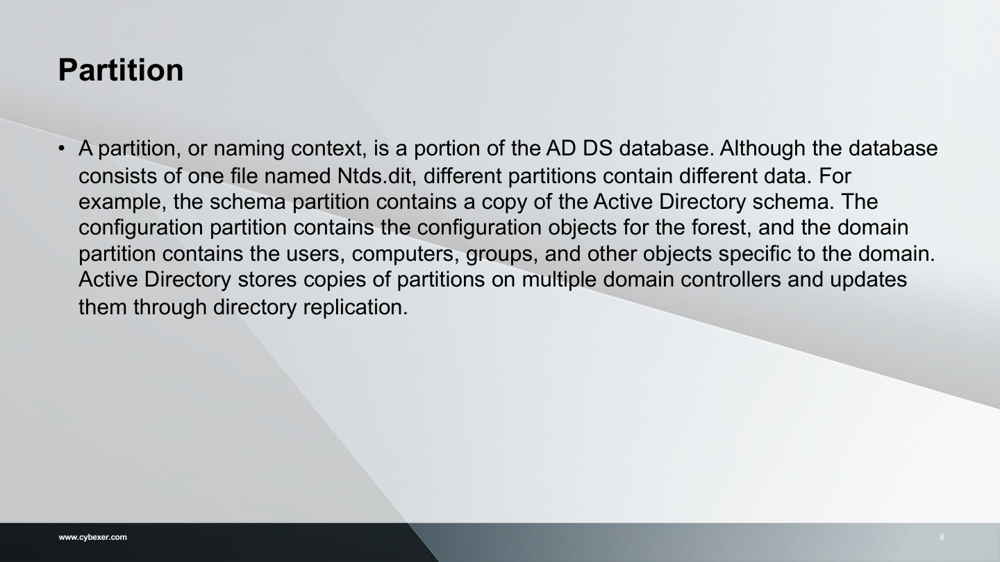

**Розділ (Partition)**

Розділ, або контекст іменування (naming context), — це частина бази даних AD DS. Хоча база даних складається з одного файлу під назвою `Ntds.dit`, різні розділи містять різні дані. Наприклад, розділ схеми (schema partition) містить копію схеми Active Directory. Розділ конфігурації (configuration partition) містить об'єкти конфігурації для лісу (forest), а розділ домену (domain partition) містить користувачів, комп'ютери, групи та інші об'єкти, що належать до конкретного домену. Active Directory зберігає копії розділів на кількох контролерах домену (domain controllers) і оновлює їх через реплікацію каталогу (directory replication).

**Три основні розділи:**

**1. Schema Partition (Розділ схеми)**
- Зберігає «правила» — які об'єкти існують в AD і які атрибути вони можуть мати
- Приклад: «об'єкт користувача має поля: ім'я, пароль, email»
- **Один на весь ліс** — однаковий на всіх контролерах домену

**2. Configuration Partition (Розділ конфігурації)**
- Зберігає структуру всього лісу: сайти, служби, зв'язки між доменами
- **Один на весь ліс** — реплікується на всі контролери домену

**3. Domain Partition (Розділ домену)**
- Зберігає самі об'єкти: користувачів, комп'ютери, групи, OU
- **Унікальний для кожного домену** — DC домену A не має розділу домену B

**Схема структури Ntds.dit:**

```
┌─────────────────────────────────────────────────────┐
│                  Файл Ntds.dit                      │
│                                                     │
│  ┌─────────────────┐  ┌──────────────────────────┐  │
│  │ Schema Partition│  │ Configuration Partition  │  │
│  │                 │  │                          │  │
│  │ - типи об'єктів │  │ - структура лісу         │  │
│  │ - атрибути      │  │ - сайти                  │  │
│  │                 │  │ - зв'язки між доменами   │  │
│  └─────────────────┘  └──────────────────────────┘  │
│       (весь ліс)              (весь ліс)             │
│                                                     │
│  ┌──────────────────────────────────────────────┐   │
│  │            Domain Partition                  │   │
│  │                                              │   │
│  │  Користувачі │ Комп'ютери │ Групи │ OU       │   │
│  └──────────────────────────────────────────────┘   │
│                  (тільки цей домен)                 │
└─────────────────────────────────────────────────────┘
```

**Реплікація між контролерами домену:**

```
  DC1 (контролер 1)        DC2 (контролер 2)
  ┌──────────────┐          ┌──────────────┐
  │ Schema       │◄────────►│ Schema       │
  │ Config       │◄────────►│ Config       │
  │ Domain       │◄────────►│ Domain       │
  └──────────────┘          └──────────────┘
         │                        │
         └────────────────────────┘
              реплікація
```

Якщо один DC падає — інший має **повну копію** всіх розділів і продовжує працювати.

> **Простими словами:** Уяви книгу (Ntds.dit) з трьома розділами: «Зміст» (Schema), «Карта» (Configuration) і «Головний текст» (Domain). Кожен контролер домену має свою копію цієї книги і постійно звіряється з іншими копіями.

---

## Сторінка 9

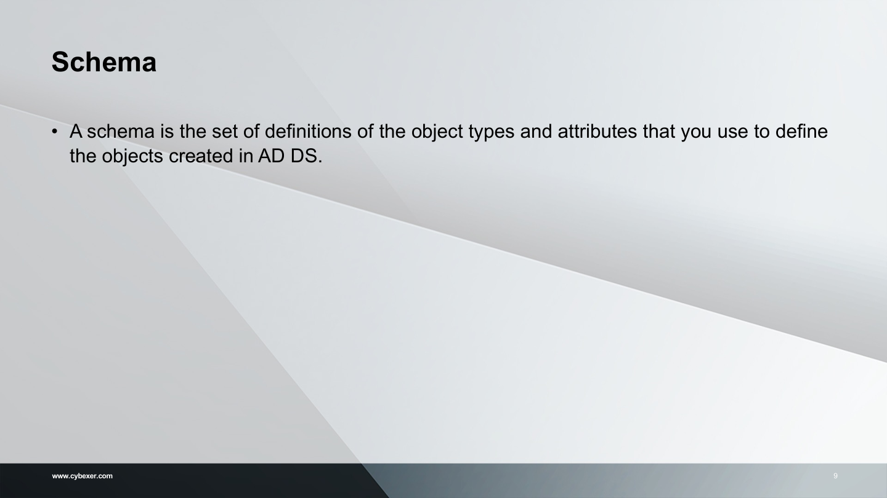

**Схема (Schema)**

Схема (schema) — це набір визначень типів об'єктів і атрибутів, які використовуються для визначення об'єктів, що створюються в AD DS.

**Проста аналогія:**
Схема — це як **бланк анкети**. Анкета визначає, які поля існують (ім'я, вік, адреса). Об'єкт AD — це заповнена анкета з конкретними даними.

**Два ключових поняття схеми:**

**1. Класи (Classes)** — типи об'єктів, які можна створити в AD:
- `user` — користувач
- `computer` — комп'ютер
- `group` — група
- `organizationalUnit` — OU

**2. Атрибути (Attributes)** — властивості, які може мати клас:
- Клас `user` має атрибути: `sAMAccountName`, `mail`, `displayName`, `password` тощо
- Клас `computer` має атрибути: `dNSHostName`, `operatingSystem` тощо

**Схема:**

```
        СХЕМА (Schema)
        ┌──────────────────────────────────────┐
        │  Клас: user                          │
        │  ┌────────────────────────────────┐  │
        │  │ Атрибути:                      │  │
        │  │  - sAMAccountName (логін)      │  │
        │  │  - displayName   (ім'я)        │  │
        │  │  - mail          (email)       │  │
        │  │  - password      (пароль)      │  │
        │  │  - ...400+ атрибутів           │  │
        │  └────────────────────────────────┘  │
        │                                      │
        │  Клас: computer                      │
        │  ┌────────────────────────────────┐  │
        │  │ Атрибути:                      │  │
        │  │  - dNSHostName  (ім'я хоста)   │  │
        │  │  - operatingSystem             │  │
        │  │  - ...                         │  │
        │  └────────────────────────────────┘  │
        └──────────────────────────────────────┘
                       ▼
        РЕАЛЬНИЙ ОБ'ЄКТ (заповнена анкета)
        ┌──────────────────────────────────────┐
        │  Об'єкт типу: user                   │
        │  sAMAccountName = "john.doe"          │
        │  displayName    = "John Doe"          │
        │  mail           = "john@company.com"  │
        └──────────────────────────────────────┘
```

**Важливі факти:**
- Схема **єдина для всього лісу** — не можна мати різні схеми в різних доменах
- Схему можна **розширювати** — додавати нові атрибути або класи (наприклад, Exchange додає свої атрибути до класу `user`)
- Схему **не можна звужувати** — видалити атрибут зі схеми неможливо, лише деактивувати
- Змінювати схему може лише член групи **Schema Admins**

> **Простими словами:** Схема — це «словник» AD, який каже: «ось які типи об'єктів існують і які поля вони мають». Без схеми AD не знало б, що таке «користувач» і які дані про нього зберігати.

---

## Сторінка 10

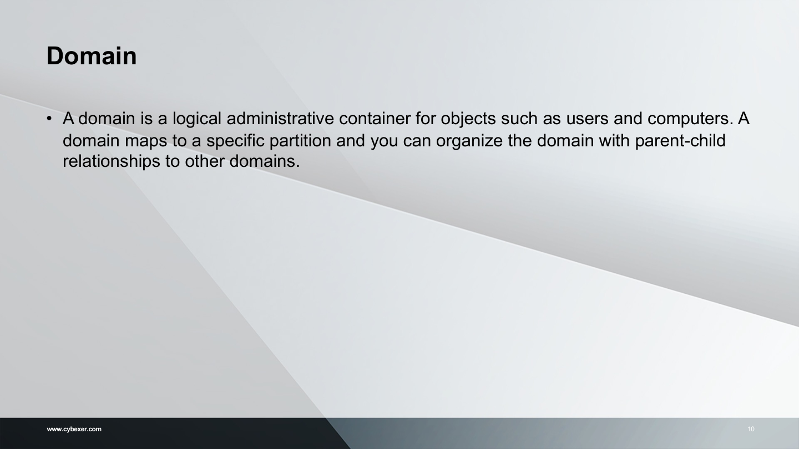

**Домен (Domain)**

Домен (domain) — це логічний адміністративний контейнер для таких об'єктів, як користувачі та комп'ютери. Домен відповідає певному розділу (partition), і домени можна організовувати у відносини батько-дитина (parent-child relationships) з іншими доменами.

**Проста аналогія:**
Домен — це як **місто**. Місто має свої правила, своїх жителів (користувачів) і свою адміністрацію (контролер домену). Різні міста можуть входити до однієї області (лісу), але кожне місто керує собою самостійно.

**Що зберігається в домені:**
- Облікові записи користувачів
- Облікові записи комп'ютерів
- Групи
- Групові політики (GPO)
- Організаційні підрозділи (OU)

**Ключові характеристики:**
- Кожен домен має своє **DNS-ім'я** (наприклад, `company.com`)
- Кожен домен має свій власний **Domain Partition** у базі Ntds.dit
- Домен — це **межа реплікації**: дані домену реплікуються між DC цього домену, але не між доменами
- Домен — це **межа адміністрування**: адміністратор одного домену не керує іншим доменом автоматично

**Відносини батько-дитина (Parent-Child):**

```
        company.com          ← батьківський домен (parent)
        ┌─────────────┐
        │  DC          │
        │  Користувачі │
        │  Комп'ютери  │
        └──────┬───────┘
               │
       ┌───────┴────────┐
       ▼                ▼
  kyiv.company.com   lviv.company.com   ← дочірні домени (child)
  ┌────────────┐     ┌────────────┐
  │ DC         │     │ DC         │
  │ Київські   │     │ Львівські  │
  │ юзери      │     │ юзери      │
  └────────────┘     └────────────┘
```

**Домен і розділ (partition):**

```
  Домен: company.com
  ┌──────────────────────────────┐
  │  Ntds.dit                    │
  │  ┌──────────────────────┐    │
  │  │ Domain Partition     │    │
  │  │ (тільки company.com) │    │
  │  └──────────────────────┘    │
  │  ┌──────────────┐            │
  │  │ Schema       │ (ліс)      │
  │  └──────────────┘            │
  │  ┌──────────────┐            │
  │  │ Config       │ (ліс)      │
  │  └──────────────┘            │
  └──────────────────────────────┘
```

> **Простими словами:** Домен — це окрема «адміністративна зона» з власними об'єктами та правилами. Домени можна вкладати один в одний як матрьошки — батьківський домен містить дочірні.

---

## Сторінка 11

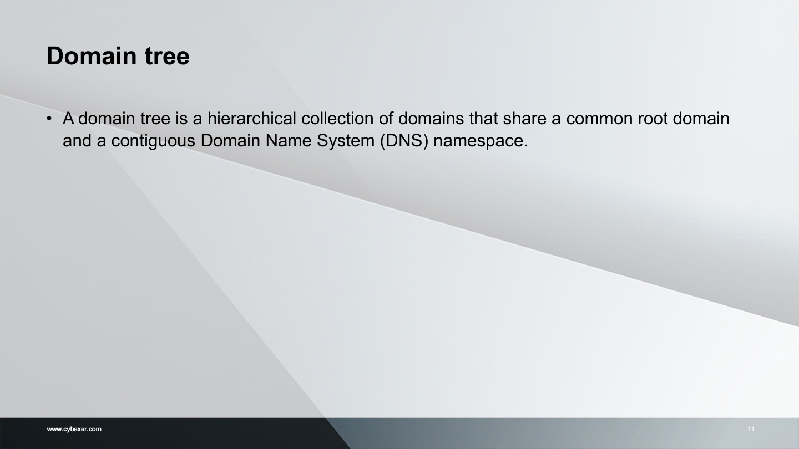

**Дерево доменів (Domain Tree)**

Дерево доменів — це ієрархічна сукупність доменів, що мають спільний кореневий домен (root domain) та суміжний простір імен DNS (contiguous Domain Name System namespace).

---

## Сторінка 12

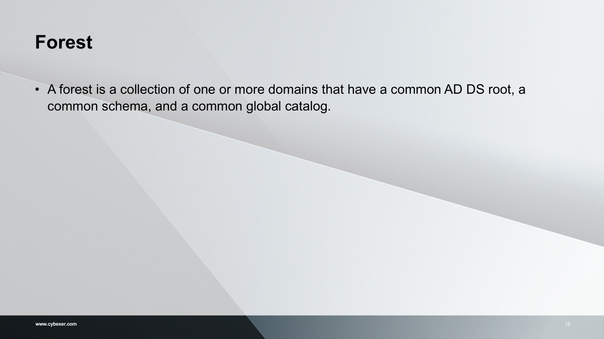

**Ліс (Forest)**

Ліс — це сукупність одного або кількох доменів, що мають спільний корінь AD DS (AD DS root), спільну схему (schema) та спільний глобальний каталог (global catalog).

---

## Сторінка 13

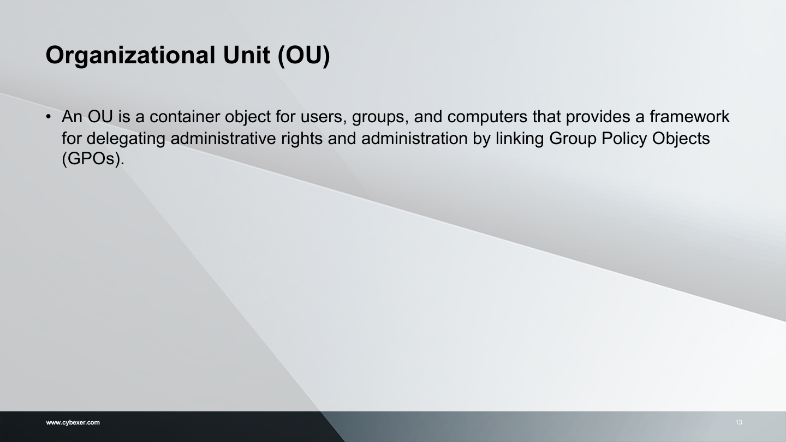

**Організаційний підрозділ (Organizational Unit — OU)**

Організаційний підрозділ (OU) — це контейнерний об'єкт для користувачів, груп і комп'ютерів, який забезпечує основу для делегування адміністративних прав (administrative rights) і управління шляхом прив'язки об'єктів групової політики (Group Policy Objects — GPOs).

---

## Сторінка 14

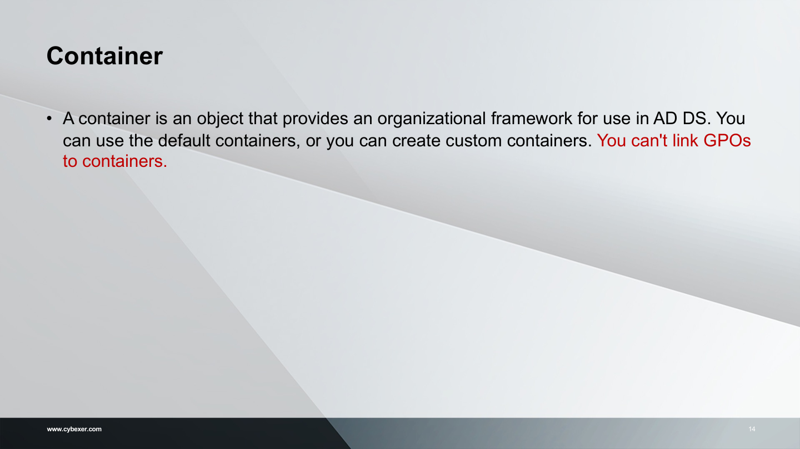

**Контейнер (Container)**

Контейнер (container) — це об'єкт, що забезпечує організаційну структуру в AD DS. Можна використовувати стандартні контейнери або створювати власні. До контейнерів не можна прив'язувати об'єкти групової політики (GPOs).

---

## Сторінка 15

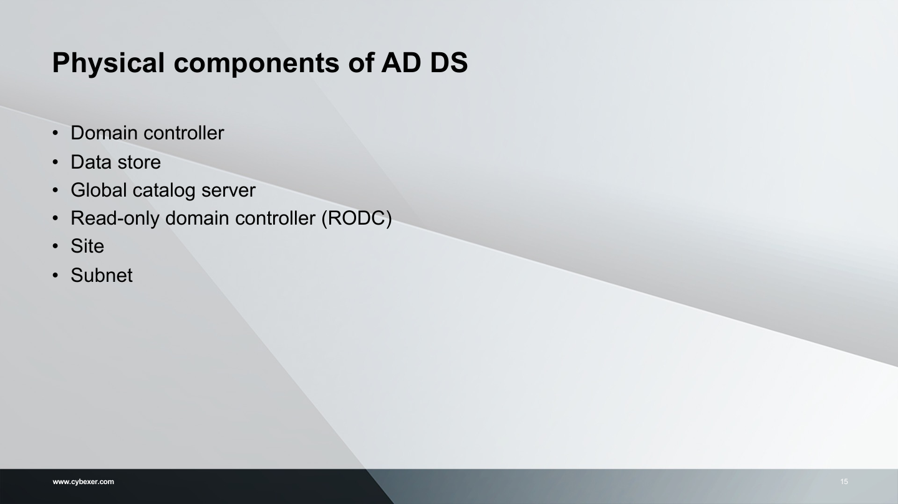

**Фізичні компоненти AD DS (Physical Components of AD DS)**

- Контролер домену (Domain controller)
- Сховище даних (Data store)
- Сервер глобального каталогу (Global catalog server)
- Контролер домену лише для читання (Read-only domain controller — RODC)
- Сайт (Site)
- Підмережа (Subnet)

---

## Сторінка 16

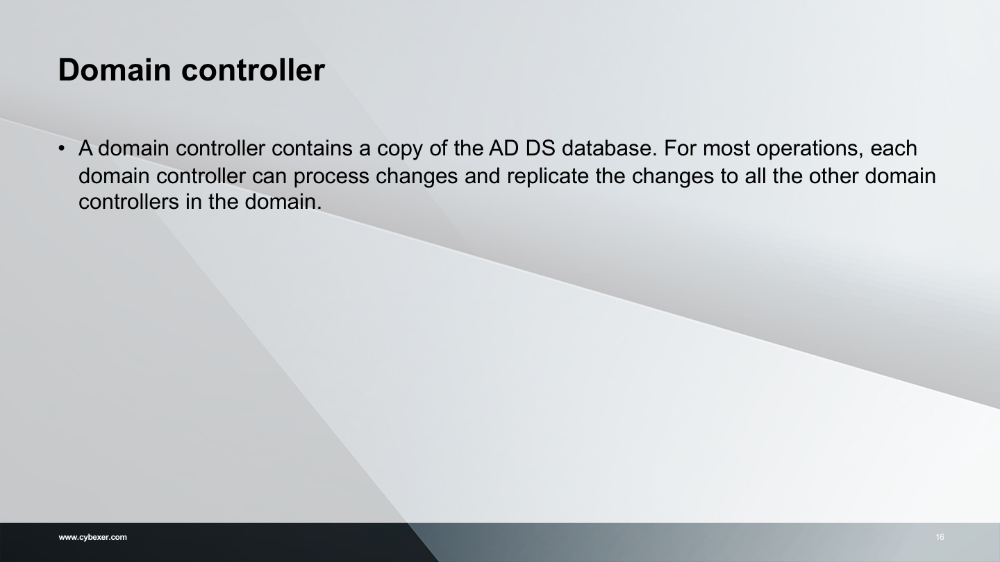

**Контролер домену (Domain Controller)**

Контролер домену містить копію бази даних AD DS. Для більшості операцій кожен контролер домену може обробляти зміни та реплікувати їх на всі інші контролери домену в домені.

---

## Сторінка 17

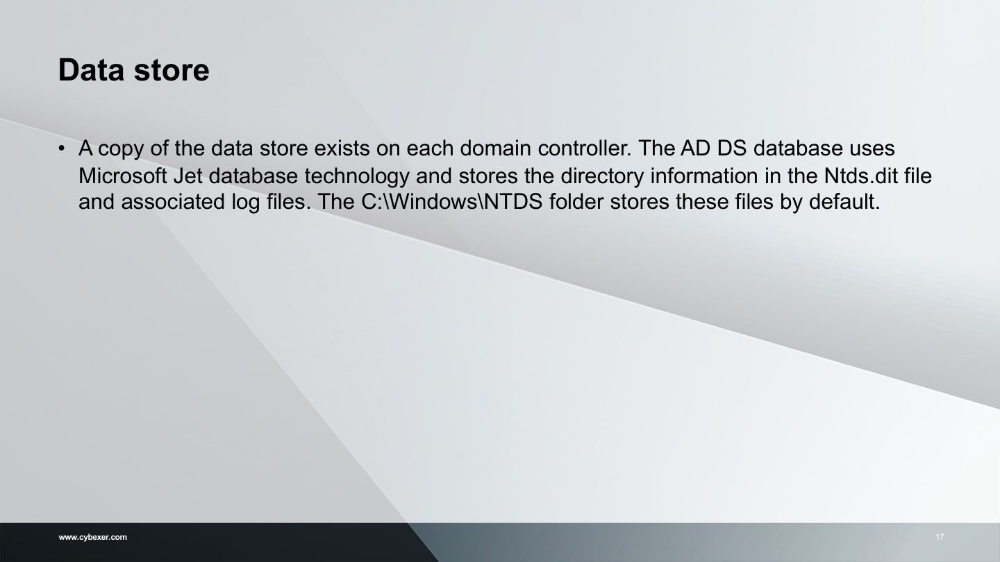

**Сховище даних (Data Store)**

Копія сховища даних (data store) існує на кожному контролері домену. База даних AD DS використовує технологію баз даних Microsoft Jet і зберігає інформацію каталогу у файлі `Ntds.dit` та пов'язаних журнальних файлах. За замовчуванням ці файли зберігаються в папці `C:\Windows\NTDS`.

---

## Сторінка 18

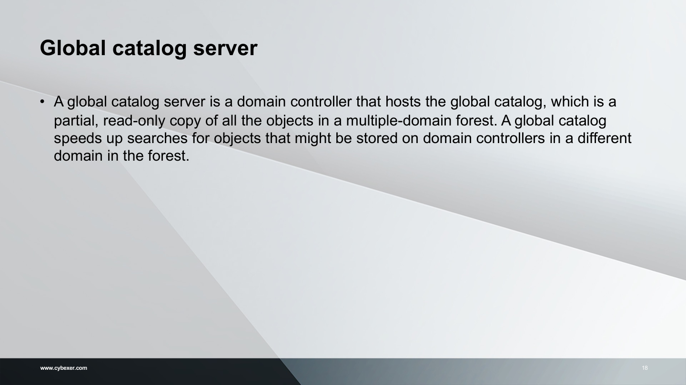

**Сервер глобального каталогу (Global Catalog Server)**

Сервер глобального каталогу — це контролер домену, який розміщує глобальний каталог (global catalog) — частковий, доступний лише для читання примірник усіх об'єктів у мультидоменному лісі (multiple-domain forest). Глобальний каталог прискорює пошук об'єктів, які можуть зберігатися на контролерах домену в іншому домені лісу.

---

## Сторінка 19

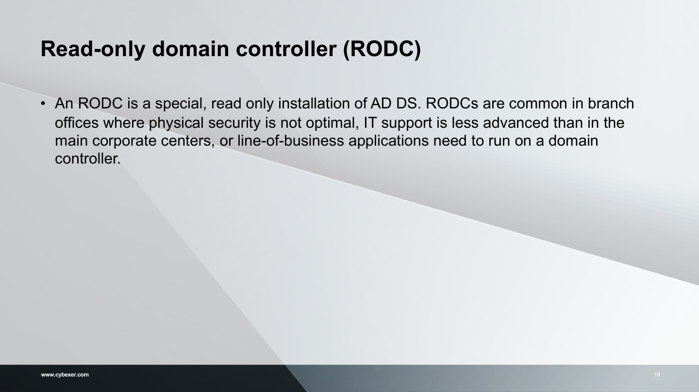

**Контролер домену лише для читання (Read-Only Domain Controller — RODC)**

RODC — це спеціальна, доступна лише для читання інсталяція AD DS. RODC поширені у філіях, де фізична безпека не є оптимальною, ІТ-підтримка менш розвинена, ніж у головних корпоративних центрах, або де бізнес-застосунки (line-of-business applications) мають запускатися на контролері домену.

---

## Сторінка 20

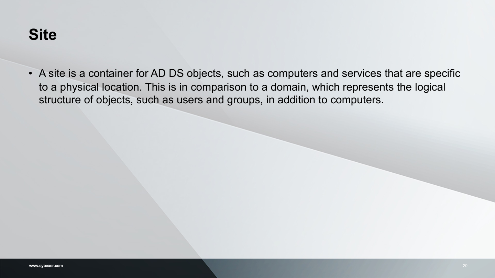

**Сайт (Site)**

Сайт — це контейнер для об'єктів AD DS, таких як комп'ютери та служби, прив'язані до конкретного фізичного місця розташування. Це відрізняється від домену (domain), який представляє логічну структуру об'єктів, таких як користувачі та групи, на додаток до комп'ютерів.

---

## Сторінка 21

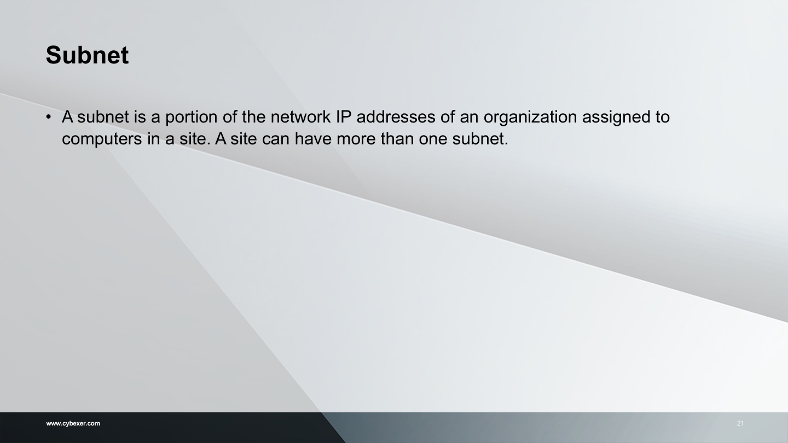

**Підмережа (Subnet)**

Підмережа — це частина IP-адрес мережі організації, призначених комп'ютерам у певному сайті (site). Один сайт може мати більше однієї підмережі.

---

## Сторінка 22

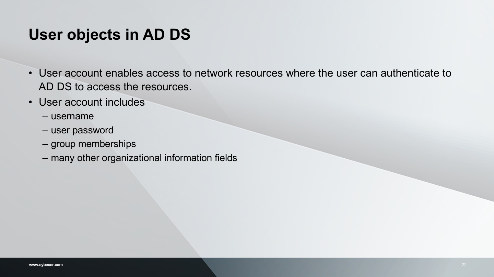

**Об'єкти користувачів в AD DS (User Objects in AD DS)**

- Обліковий запис користувача (user account) надає доступ до мережевих ресурсів, де користувач може пройти автентифікацію (authenticate) в AD DS для доступу до ресурсів
- Обліковий запис користувача включає:
  - ім'я користувача (username)
  - пароль користувача (user password)
  - членство в групах (group memberships)
  - багато інших організаційних інформаційних полів

---

## Сторінка 23

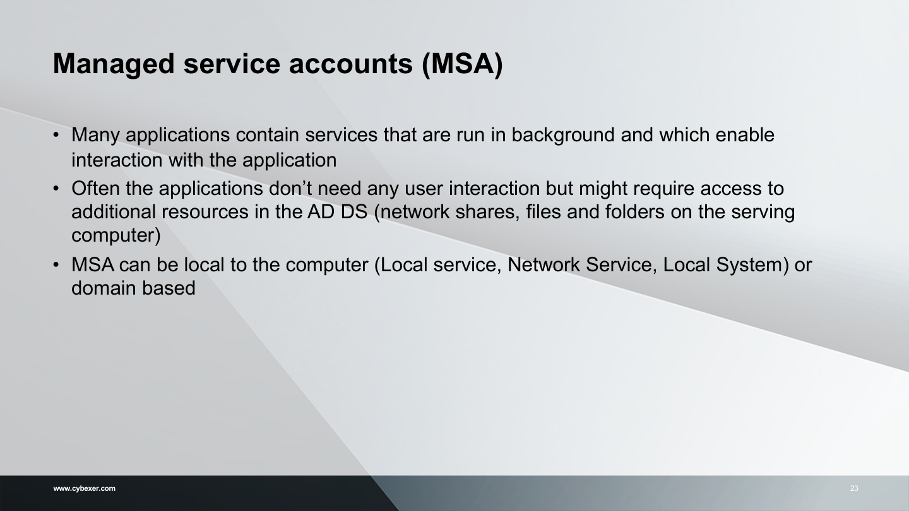

**Облікові записи керованих служб (Managed Service Accounts — MSA)**

- Багато застосунків містять служби (services), що виконуються у фоновому режимі та забезпечують взаємодію з застосунком
- Часто застосункам не потрібна взаємодія з користувачем, але може знадобитися доступ до додаткових ресурсів AD DS (мережеві папки, файли та теки на сервері)
- MSA можуть бути локальними для комп'ютера (Local Service, Network Service, Local System) або доменними (domain based)

---

## Сторінка 24

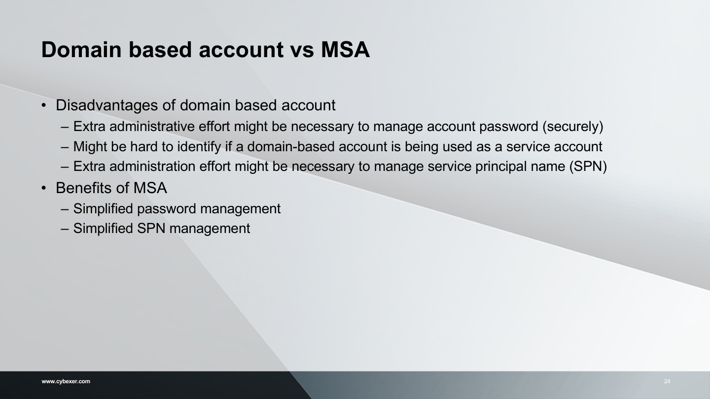

**Доменний обліковий запис проти MSA (Domain Based Account vs MSA)**

**Недоліки доменного облікового запису:**
- Може знадобитися додаткове адміністративне зусилля для безпечного управління паролем
- Може бути важко визначити, чи використовується доменний обліковий запис як службовий
- Може знадобитися додаткове адміністративне зусилля для управління іменем принципала служби (SPN — Service Principal Name)

**Переваги MSA:**
- Спрощене управління паролями (password management)
- Спрощене управління SPN

---

## Сторінка 25

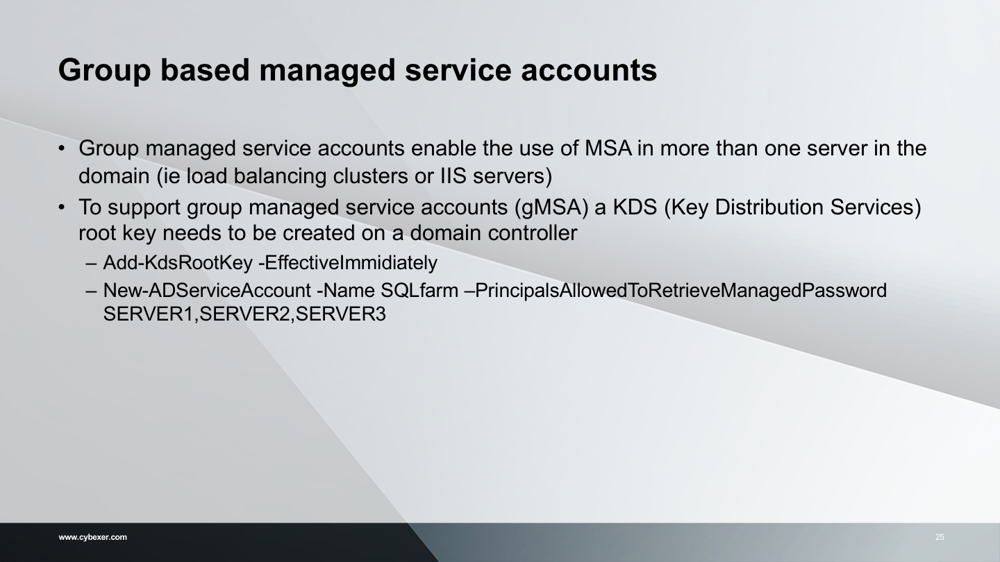

**Групові облікові записи керованих служб (Group Managed Service Accounts — gMSA)**

Групові облікові записи керованих служб дозволяють використовувати MSA на кількох серверах домену (наприклад, кластери балансування навантаження або сервери IIS).

Для підтримки gMSA необхідно створити кореневий ключ KDS (Key Distribution Services) на контролері домену:

```
Add-KdsRootKey -EffectiveImmidiately
New-ADServiceAccount -Name SQLfarm –PrincipalsAllowedToRetrieveManagedPassword SERVER1,SERVER2,SERVER3
```

---

## Сторінка 26

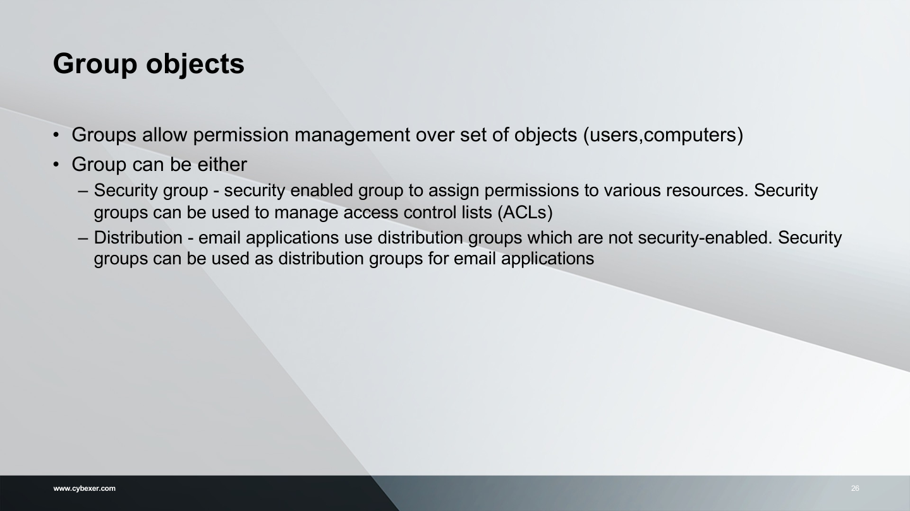

**Об'єкти груп (Group Objects)**

- Групи дозволяють управляти дозволами для набору об'єктів (користувачі, комп'ютери)
- Група може бути:
  - **Група безпеки (Security group)** — група з підтримкою безпеки для призначення дозволів на різні ресурси. Групи безпеки можна використовувати для управління списками контролю доступу (ACL — Access Control Lists)
  - **Група розповсюдження (Distribution group)** — поштові застосунки використовують групи розповсюдження, які не мають підтримки безпеки. Групи безпеки можна використовувати як групи розповсюдження для поштових застосунків

---

## Сторінка 27

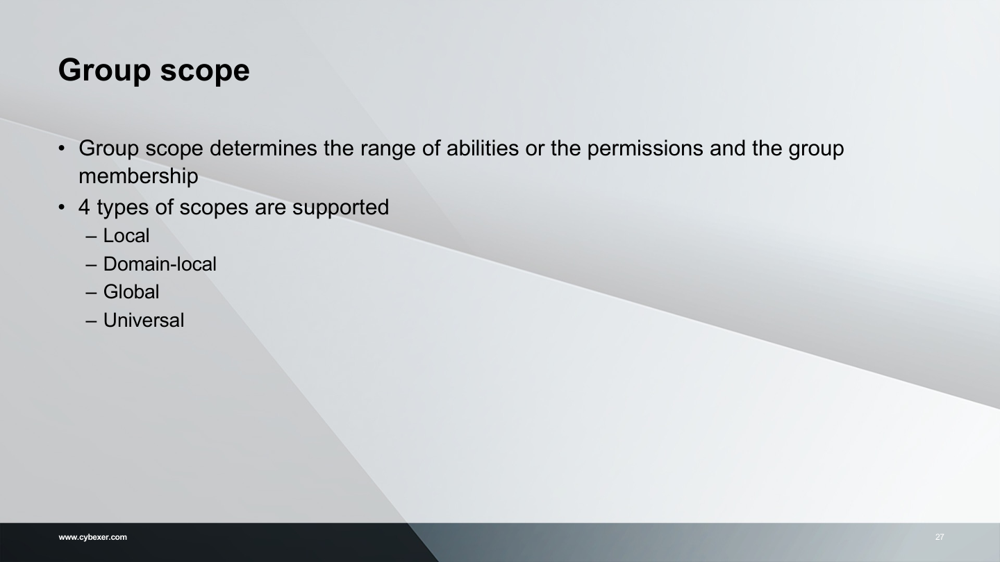

**Область дії груп (Group Scope)**

Область дії групи (group scope) визначає діапазон можливостей, дозволів та членство в групі. Підтримується 4 типи областей:

- Локальна (Local)
- Локальна домену (Domain-local)
- Глобальна (Global)
- Універсальна (Universal)

---

## Сторінка 28

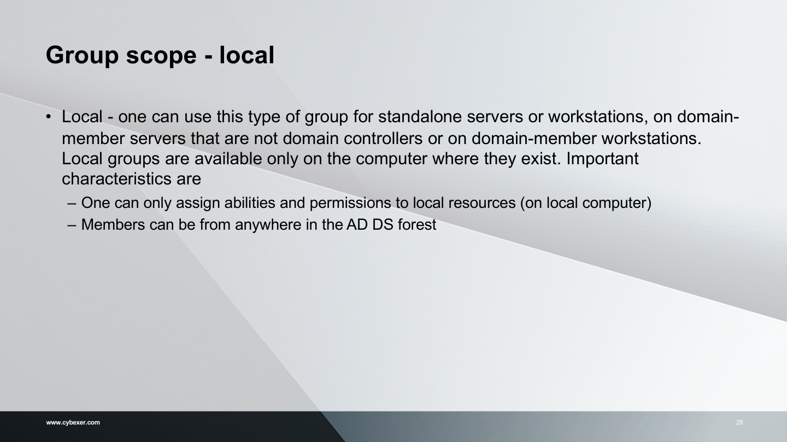

**Область дії груп — локальна (Group Scope — Local)**

Локальна — цей тип групи можна використовувати для автономних серверів або робочих станцій, на серверах-членах домену, що не є контролерами домену, або на робочих станціях-членах домену. Локальні групи доступні лише на тому комп'ютері, де вони існують. Важливі характеристики:

- Можна призначати можливості та дозволи лише для локальних ресурсів (на локальному комп'ютері)
- Членами можуть бути об'єкти з будь-якого місця в лісі AD DS

---

## Сторінка 29

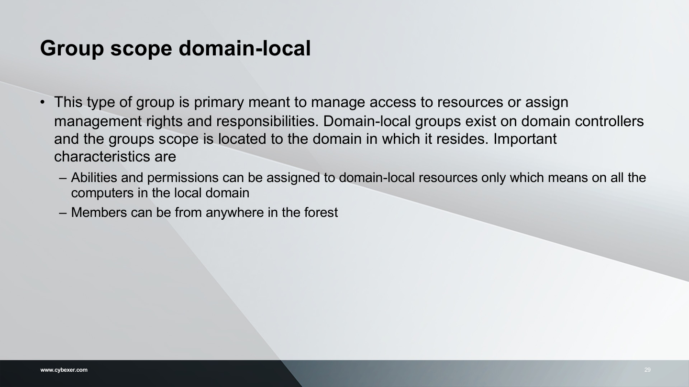

**Область дії груп — локальна домену (Group Scope — Domain-Local)**

Цей тип групи призначений насамперед для управління доступом до ресурсів або призначення прав та обов'язків адміністрування. Групи з областю дії домену існують на контролерах домену, і область дії груп обмежена доменом, в якому вони перебувають. Важливі характеристики:

- Можливості та дозволи можна призначати лише для ресурсів локального домену — тобто на всіх комп'ютерах у локальному домені
- Членами можуть бути об'єкти з будь-якого місця в лісі

---

## Сторінка 30

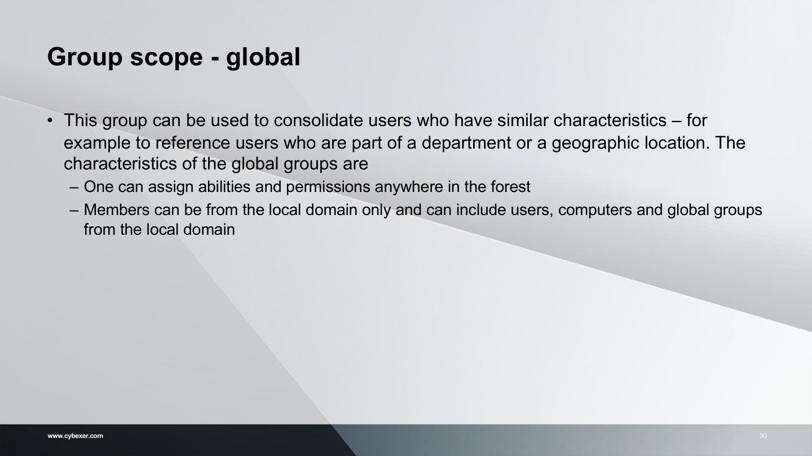

**Область дії груп — глобальна (Group Scope — Global)**

Цю групу можна використовувати для об'єднання користувачів зі схожими характеристиками — наприклад, для посилання на користувачів, що належать до певного відділу або географічного розташування. Характеристики глобальних груп:

- Можна призначати можливості та дозволи будь-де в лісі
- Членами можуть бути лише об'єкти з локального домену: користувачі, комп'ютери та глобальні групи з локального домену

---

## Сторінка 31

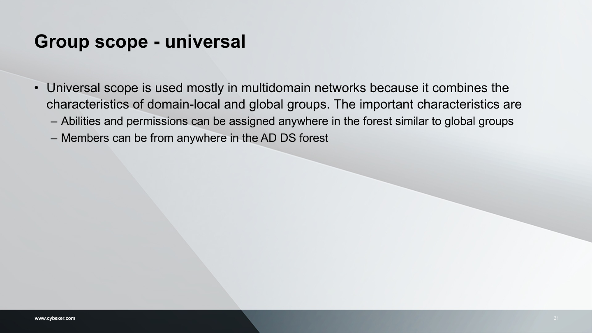

**Область дії груп — універсальна (Group Scope — Universal)**

Універсальна область дії використовується переважно в мультидоменних мережах, оскільки поєднує характеристики груп з областями дії «локальна домену» та «глобальна». Важливі характеристики:

- Можливості та дозволи можна призначати будь-де в лісі, як і для глобальних груп
- Членами можуть бути об'єкти з будь-якого місця в лісі AD DS

---

## Сторінка 32

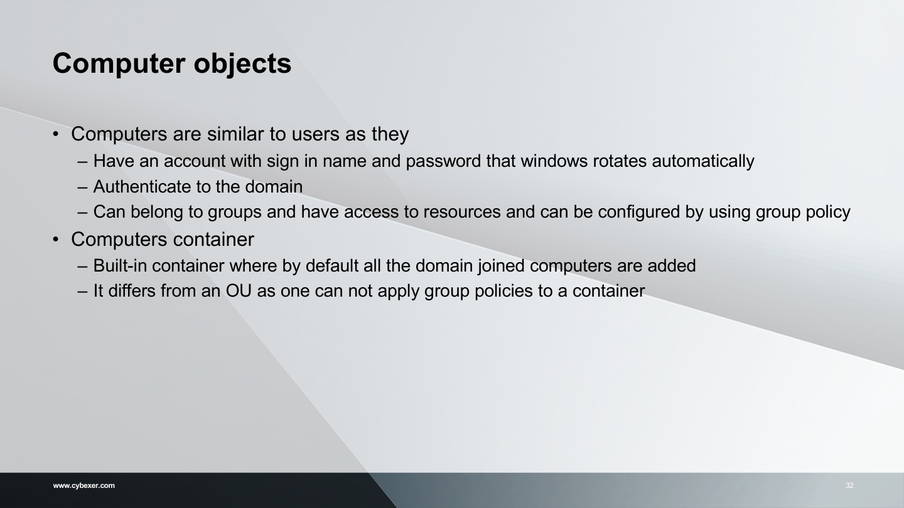

**Об'єкти комп'ютерів (Computer Objects)**

Комп'ютери схожі на користувачів:
- Мають обліковий запис з іменем для входу та паролем, який Windows автоматично змінює
- Проходять автентифікацію в домені (authenticate to the domain)
- Можуть належати до груп, мати доступ до ресурсів і налаштовуватися за допомогою групової політики (group policy)

**Контейнер Computers:**
- Вбудований контейнер, куди за замовчуванням додаються всі комп'ютери, що приєдналися до домену
- Відрізняється від OU тим, що до контейнера не можна застосовувати групові політики

---

## Сторінка 33

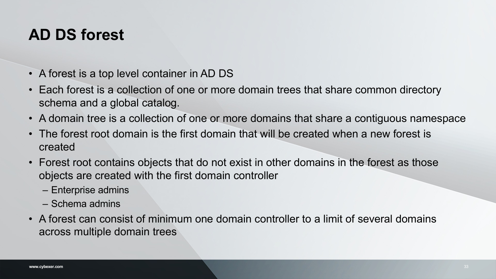

**Ліс AD DS (AD DS Forest)**

- Ліс — це контейнер верхнього рівня в AD DS
- Кожен ліс — це сукупність одного або кількох дерев доменів (domain trees), що мають спільну схему каталогу (directory schema) та спільний глобальний каталог (global catalog)
- Дерево доменів — це сукупність одного або кількох доменів із суміжним простором імен (contiguous namespace)
- Кореневий домен лісу (forest root domain) — перший домен, що створюється при створенні нового лісу
- Кореневий домен лісу містить об'єкти, яких немає в інших доменах лісу:
  - Enterprise Admins (адміністратори підприємства)
  - Schema Admins (адміністратори схеми)
- Ліс може складатися мінімум з одного контролера домену і до необмеженої кількості доменів у кількох деревах доменів

---

## Сторінка 34

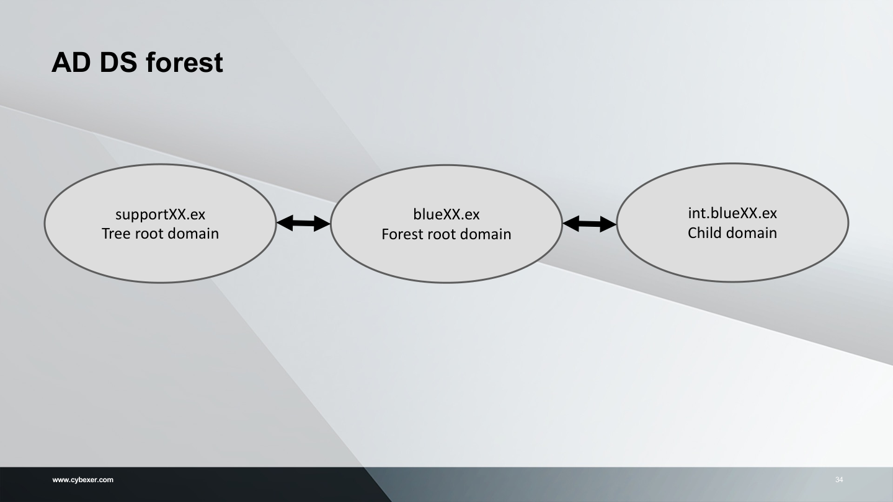

**Ліс AD DS — схема (AD DS Forest Diagram)**

```
blueXX.ex          ← Кореневий домен лісу (Forest root domain)
supportXX.ex       ← Кореневий домен дерева (Tree root domain)
int.blueXX.ex      ← Дочірній домен (Child domain)
```

---

## Сторінка 35

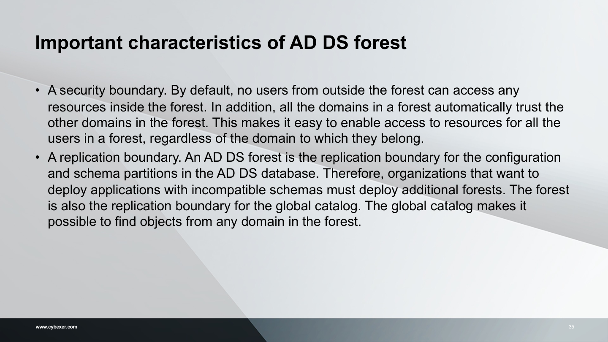

**Важливі характеристики лісу AD DS (Important Characteristics of AD DS Forest)**

- **Межа безпеки (Security boundary).** За замовчуванням жодні користувачі ззовні лісу не можуть отримати доступ до ресурсів усередині лісу. Крім того, усі домени в лісі автоматично довіряють одне одному.

- **Межа реплікації (Replication boundary).** Ліс AD DS є межею реплікації для розділів конфігурації та схеми (configuration and schema partitions) бази даних AD DS. Ліс також є межею реплікації для глобального каталогу (global catalog).

---

## Сторінка 36

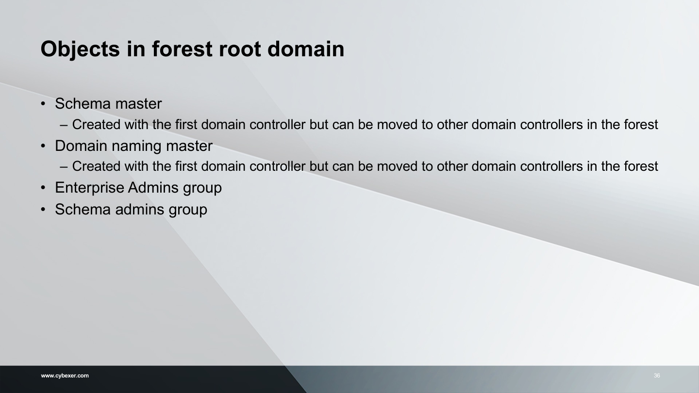

**Об'єкти в кореневому домені лісу (Objects in Forest Root Domain)**

- **Schema master (хазяїн схеми)**
  - Створюється разом із першим контролером домену, але може бути переміщений на інші контролери домену в лісі
- **Domain naming master (хазяїн іменування доменів)**
  - Створюється разом із першим контролером домену, але може бути переміщений на інші контролери домену в лісі
- Група Enterprise Admins (адміністратори підприємства)
- Група Schema Admins (адміністратори схеми)

---

## Сторінка 37

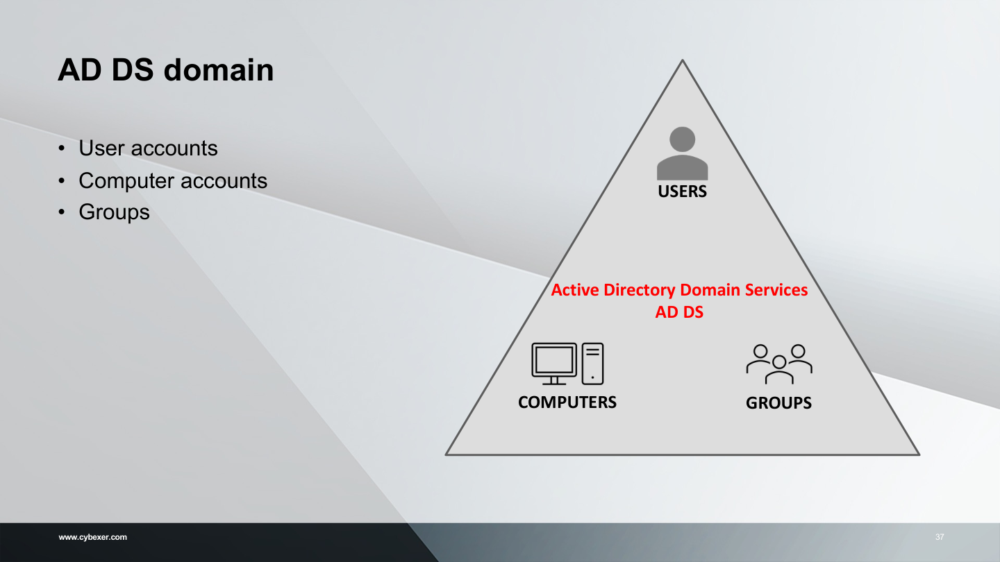

**Домен AD DS (AD DS Domain)**

- Облікові записи користувачів (User accounts)
- Облікові записи комп'ютерів (Computer accounts)
- Групи (Groups)

*Active Directory Domain Services (AD DS)*

---

## Сторінка 38

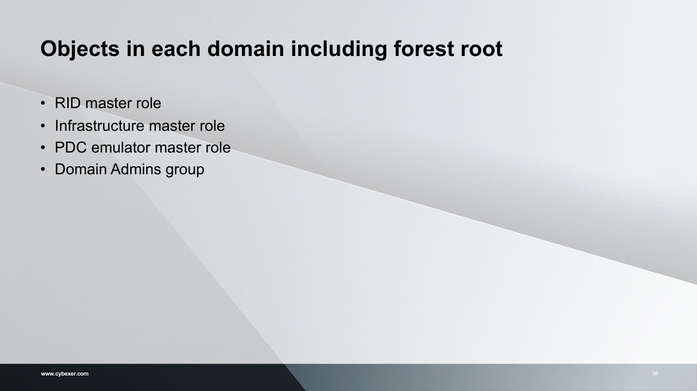

**Об'єкти в кожному домені, включно з кореневим (Objects in Each Domain Including Forest Root)**

- Роль хазяїна RID (RID master role)
- Роль хазяїна інфраструктури (Infrastructure master role)
- Роль хазяїна емулятора PDC (PDC emulator master role)
- Група Domain Admins (адміністратори домену)

---

## Сторінка 39

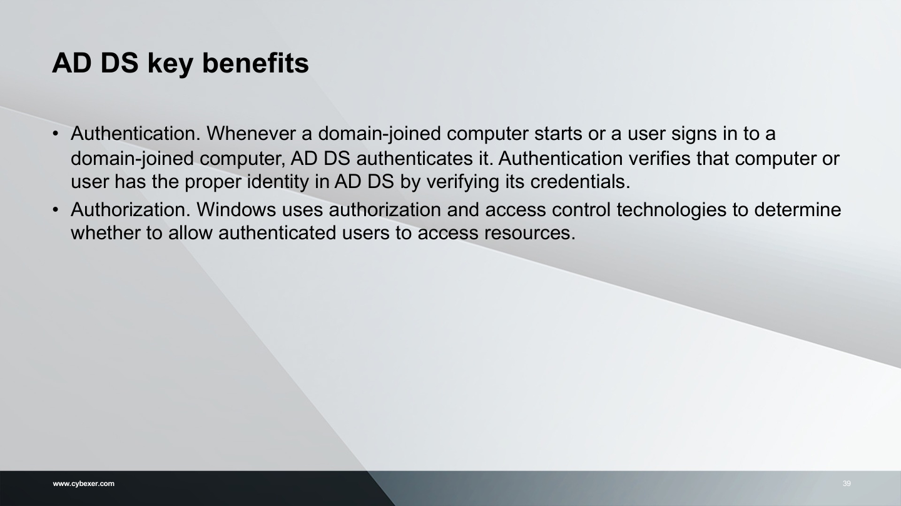

**Ключові переваги AD DS (AD DS Key Benefits)**

- **Автентифікація (Authentication).** Щоразу, коли комп'ютер, приєднаний до домену, запускається або користувач входить у систему, AD DS виконує автентифікацію. Автентифікація підтверджує, що комп'ютер або користувач має правильну ідентичність в AD DS, перевіряючи його облікові дані (credentials).

- **Авторизація (Authorization).** Windows використовує технології авторизації та контролю доступу (authorization and access control), щоб визначити, чи дозволити автентифікованим користувачам доступ до ресурсів.

---

## Сторінка 40

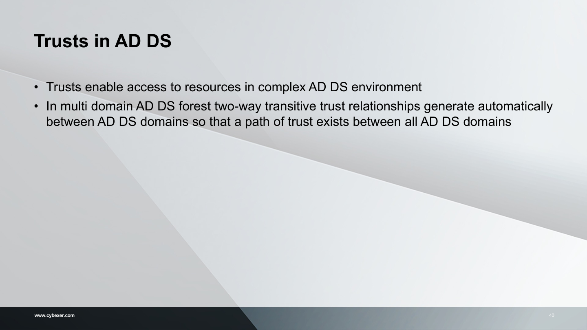

**Довіри в AD DS (Trusts in AD DS)**

- Довіри (trusts) забезпечують доступ до ресурсів у складному середовищі AD DS
- У мультидоменному лісі AD DS між доменами автоматично генеруються двосторонні транзитивні відносини довіри (two-way transitive trust relationships)

---

## Сторінка 41

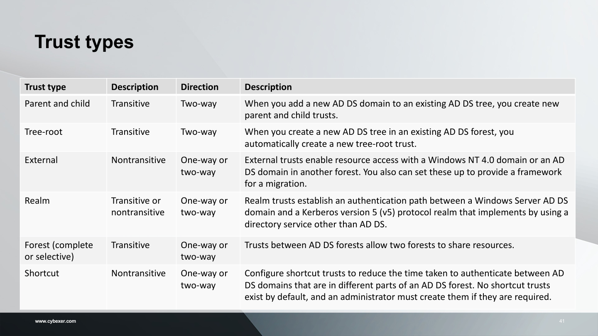

**Типи довір (Trust Types)**

| Тип довіри | Транзитивність | Напрямок | Опис |
|---|---|---|---|
| Батько-дитина (Parent and child) | Транзитивна | Двостороння | Коли ви додаєте новий домен AD DS до існуючого дерева AD DS |
| Кореневе дерево (Tree-root) | Транзитивна | Двостороння | Коли ви створюєте нове дерево AD DS в існуючому лісі AD DS |
| Зовнішня (External) | Нетранзитивна | Одностороння або двостороння | Зовнішні довіри дозволяють доступ до ресурсів у домені Windows NT 4.0 або домені AD DS в іншому лісі |
| Область (Realm) | Транзитивна або нетранзитивна | Одностороння або двостороння | Довіри областей встановлюють шлях автентифікації між доменом AD DS і областю Kerberos v5 |
| Ліс (Forest) | Транзитивна | Одностороння або двостороння | Довіри між лісами AD DS дозволяють двом лісам спільно використовувати ресурси |
| Ярлик (Shortcut) | Нетранзитивна | Одностороння або двостороння | Скорочення часу автентифікації між доменами в різних частинах лісу |

---

## Сторінка 42

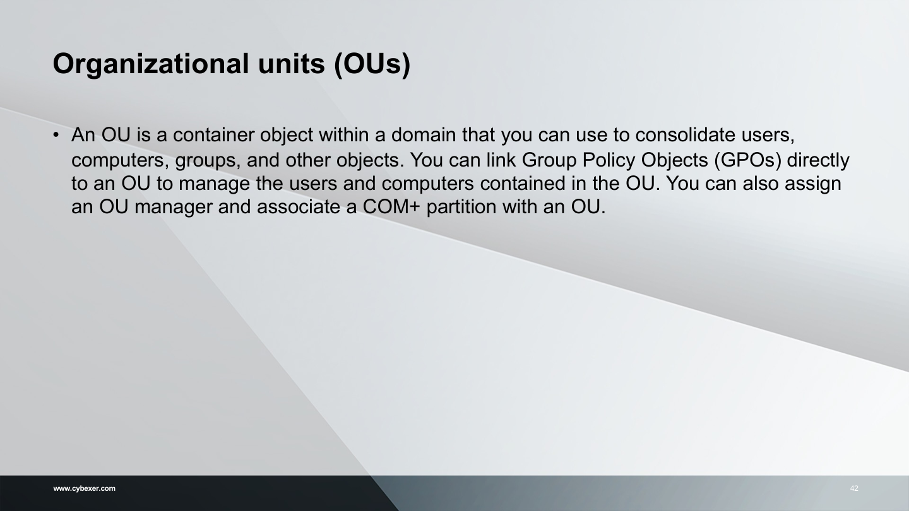

**Організаційні підрозділи (Organizational Units — OUs)**

Організаційний підрозділ (OU) — це контейнерний об'єкт у домені, який можна використовувати для об'єднання користувачів, комп'ютерів, груп та інших об'єктів. До OU можна безпосередньо прив'язувати об'єкти групової політики (Group Policy Objects — GPOs) для управління користувачами та комп'ютерами, що містяться в OU.

---

## Сторінка 43

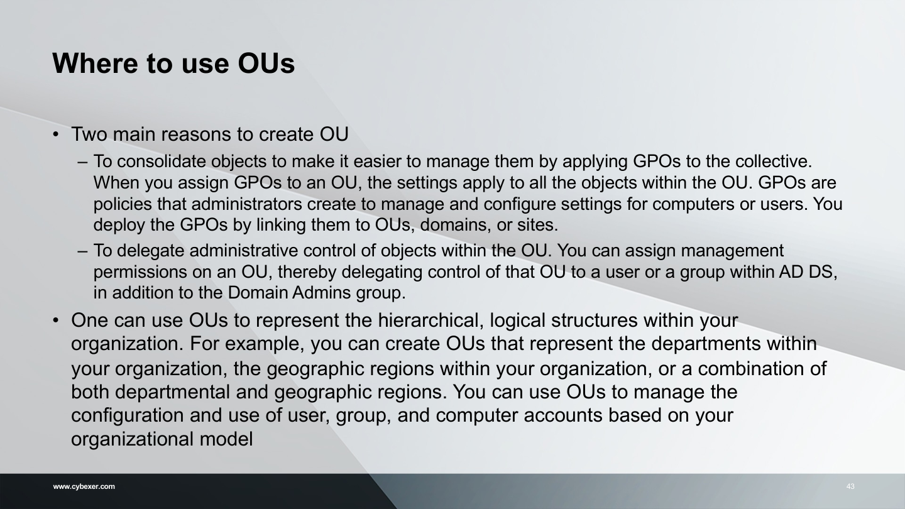

**Де використовувати OU (Where to Use OUs)**

Дві основні причини для створення OU:

1. **Об'єднання об'єктів для полегшення управління шляхом застосування GPO.** Коли ви призначаєте GPO до OU, параметри застосовуються до всіх об'єктів у OU.

2. **Делегування адміністративного контролю.** Можна призначати дозволи на управління OU, тим самим делегуючи контроль над цим OU користувачеві або групі в AD DS.

OU можна використовувати для відображення ієрархічних логічних структур у вашій організації (відділи, географічні регіони або їх комбінація).

---

## Сторінка 44

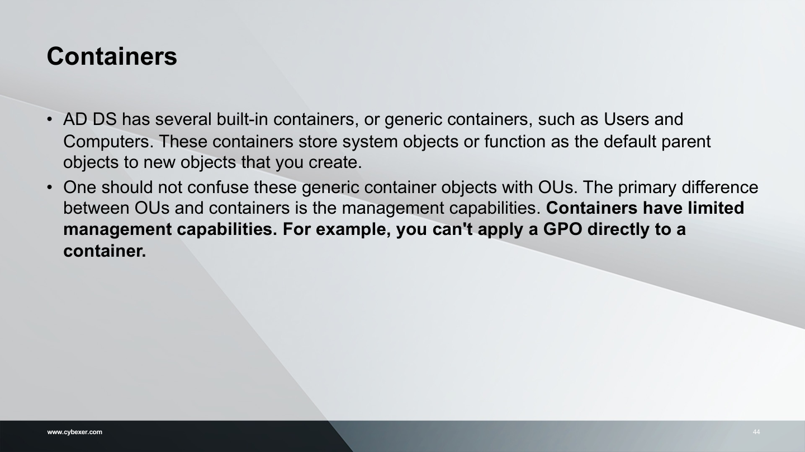

**Контейнери (Containers)**

AD DS має кілька вбудованих контейнерів (generic containers), наприклад Users і Computers. Основна відмінність між OU та контейнерами — в можливостях управління. До контейнера не можна безпосередньо застосувати GPO.

---

## Сторінка 45

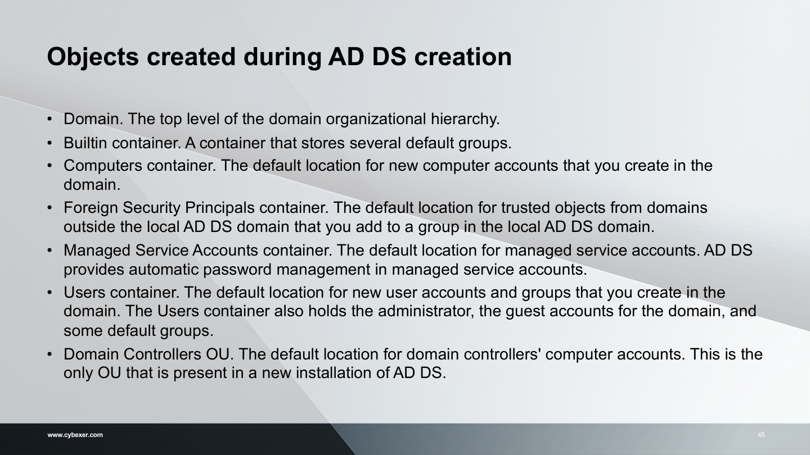

**Об'єкти, що створюються під час розгортання AD DS (Objects Created During AD DS Creation)**

- **Домен (Domain)** — верхній рівень ієрархії організації домену
- **Вбудований контейнер (Builtin container)** — контейнер для кількох груп за замовчуванням
- **Контейнер Computers** — місце за замовчуванням для нових облікових записів комп'ютерів
- **Контейнер Foreign Security Principals** — місце за замовчуванням для довірених об'єктів із зовнішніх доменів
- **Контейнер Managed Service Accounts** — місце за замовчуванням для керованих облікових записів служб
- **Контейнер Users** — місце за замовчуванням для нових облікових записів користувачів і груп
- **OU Domain Controllers** — місце за замовчуванням для облікових записів комп'ютерів контролерів домену

---

## Сторінка 46

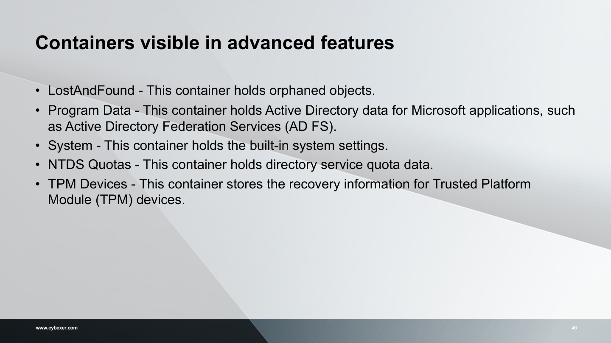

**Контейнери, видимі в режимі розширених функцій (Containers Visible in Advanced Features)**

- **LostAndFound** — контейнер для осиротілих об'єктів (orphaned objects)
- **Program Data** — містить дані Active Directory для застосунків Microsoft, таких як Active Directory Federation Services (AD FS)
- **System** — містить вбудовані системні параметри
- **NTDS Quotas** — містить дані квот служби каталогу (directory service quota data)
- **TPM Devices** — зберігає відновлювальну інформацію для пристроїв Trusted Platform Module (TPM)

---

## Сторінка 47

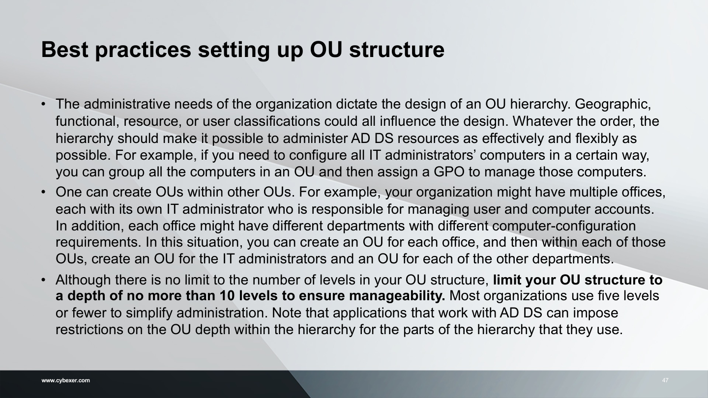

**Найкращі практики налаштування структури OU (Best Practices Setting Up OU Structure)**

Дизайн ієрархії OU визначається адміністративними потребами організації. OU можна створювати в середині інших OU.

Рекомендується обмежувати глибину структури не більше ніж **10 рівнями**. Більшість організацій використовують **5 або менше рівнів**.

---

## Сторінка 48

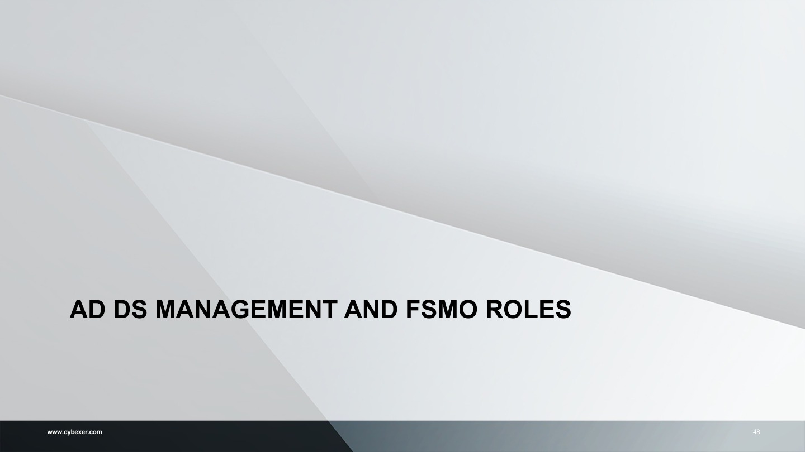

# УПРАВЛІННЯ AD DS ТА РОЛІ FSMO (AD DS Management and FSMO Roles)

---

## Сторінка 49

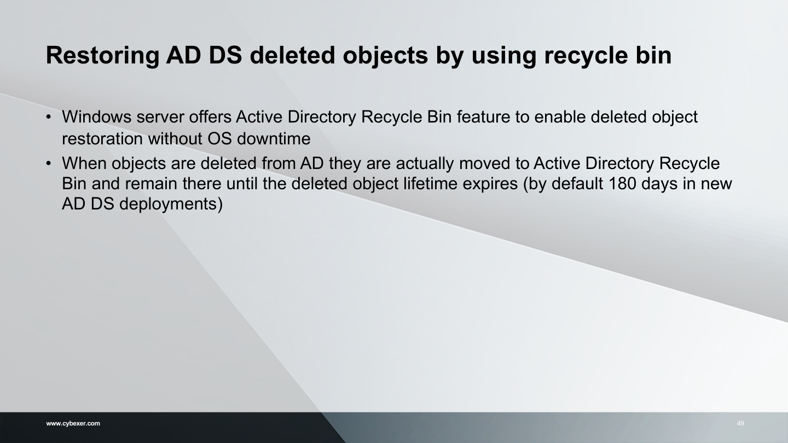

**Відновлення видалених об'єктів AD DS за допомогою кошика (Restoring AD DS Deleted Objects Using Recycle Bin)**

- Windows Server пропонує функцію кошика Active Directory (Active Directory Recycle Bin) для відновлення видалених об'єктів без простою ОС
- Видалені об'єкти залишаються в кошику до закінчення терміну зберігання (за замовчуванням — **180 днів**)

---

## Сторінка 50

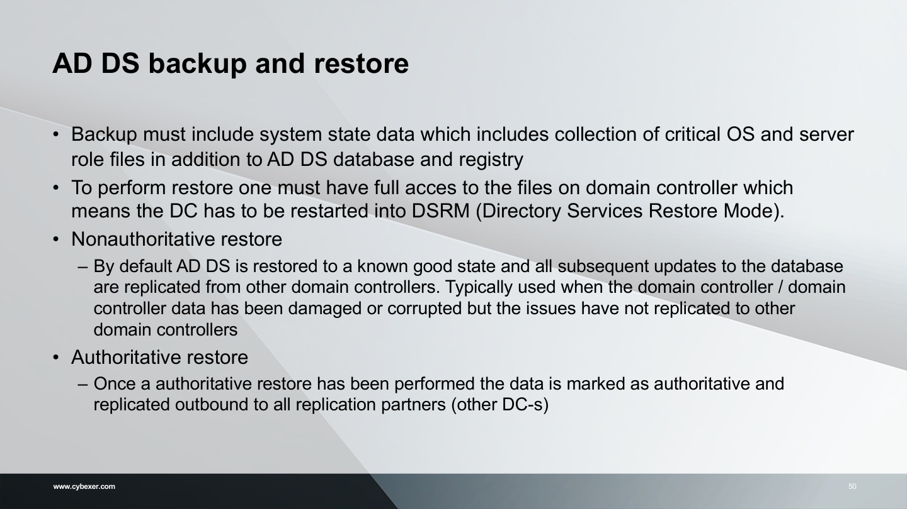

**Резервне копіювання та відновлення AD DS (AD DS Backup and Restore)**

- Резервна копія повинна включати дані системного стану (system state data): критичні файли ОС і серверних ролей, а також базу даних AD DS і реєстр (registry)
- Для виконання відновлення необхідний перезапуск контролера домену в режимі DSRM (Directory Services Restore Mode)

**Неавторитативне відновлення (Nonauthoritative Restore):** AD DS відновлюється до відомого коректного стану, і всі подальші оновлення реплікуються з інших контролерів домену.

**Авторитативне відновлення (Authoritative Restore):** Дані позначаються як авторитативні та реплікуються на всіх партнерів реплікації.

---

## Сторінка 51

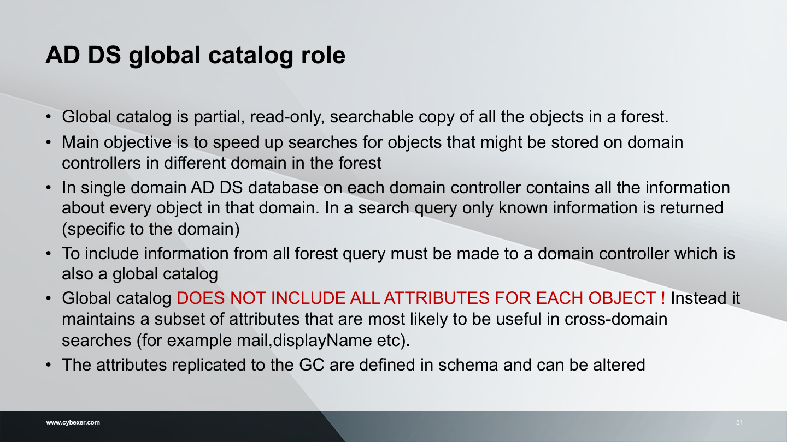

**Роль глобального каталогу AD DS (AD DS Global Catalog Role)**

- Глобальний каталог (global catalog) — це частковий, доступний лише для читання примірник усіх об'єктів у лісі
- **Глобальний каталог НЕ МІСТИТЬ УСІХ АТРИБУТІВ ДЛЯ КОЖНОГО ОБ'ЄКТА!** Він підтримує підмножину атрибутів (наприклад, mail, displayName)
- Атрибути, що реплікуються в GC, визначаються в схемі (schema) і можуть бути змінені

---

## Сторінка 52

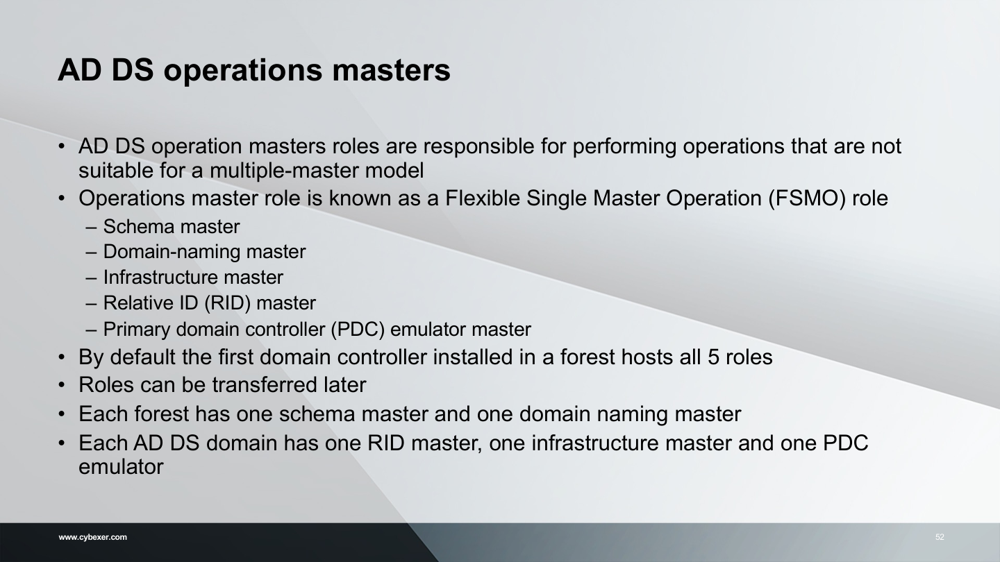

**Хазяїни операцій AD DS (AD DS Operations Masters)**

Ролі FSMO (Flexible Single Master Operation):
- Хазяїн схеми (Schema master)
- Хазяїн іменування доменів (Domain-naming master)
- Хазяїн інфраструктури (Infrastructure master)
- Хазяїн відносних ідентифікаторів (RID master)
- Хазяїн емулятора PDC (PDC emulator master)

За замовчуванням перший контролер домену в лісі розміщує всі 5 ролей.

---

## Сторінка 53

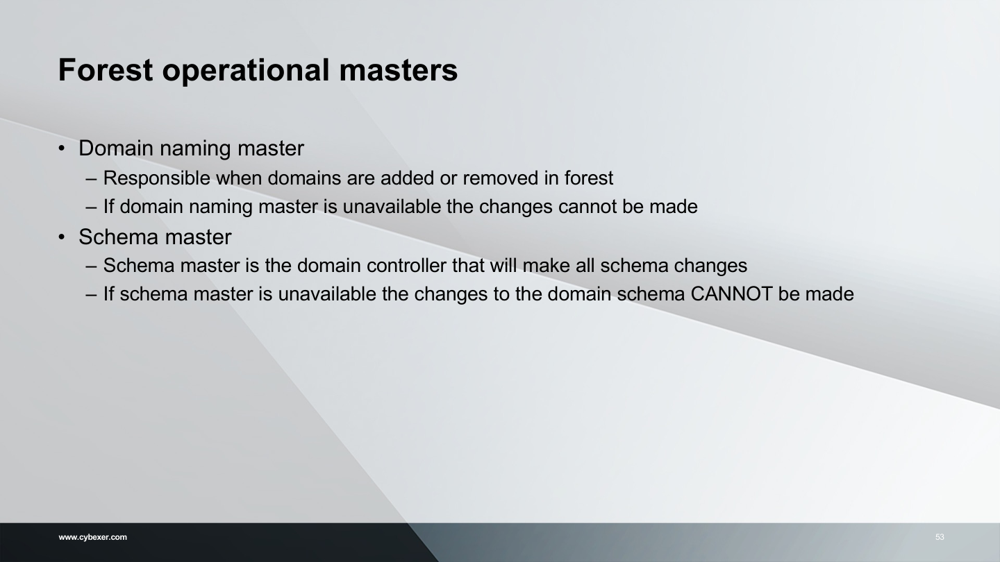

**Хазяїни операцій лісу (Forest Operational Masters)**

**Хазяїн іменування доменів (Domain naming master):** відповідає за додавання або видалення доменів у лісі.

**Хазяїн схеми (Schema master):** це контролер домену, який вносить усі зміни до схеми.

---

## Сторінка 54

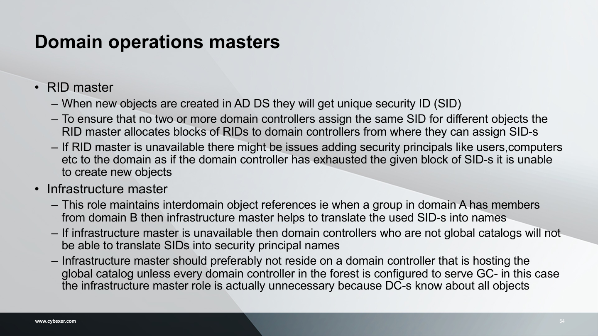

**Хазяїни операцій домену (Domain Operations Masters)**

**Хазяїн RID:** виділяє блоки RID контролерам домену для призначення унікальних SID об'єктам.

**Хазяїн інфраструктури:** підтримує посилання на об'єкти між доменами — перекладає SID у імена принципалів безпеки.

---

## Сторінка 55

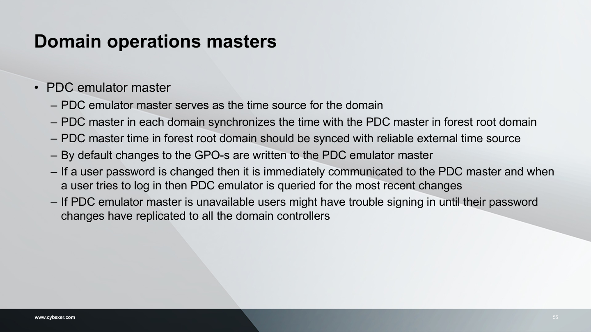

**Хазяїн емулятора PDC (PDC Emulator Master)**

- Слугує джерелом часу для домену
- Час хазяїна PDC в кореневому домені лісу синхронізується з надійним зовнішнім джерелом часу
- За замовчуванням зміни GPO записуються на хазяїна емулятора PDC
- При зміні пароля користувача — негайно повідомляється хазяїну PDC

---

## Сторінка 56

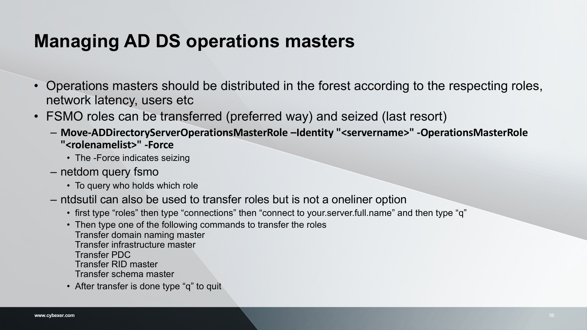

**Управління хазяїнами операцій AD DS (Managing AD DS Operations Masters)**

Ролі FSMO можна **передавати** та **захоплювати** (seizing — крайній захід):

```powershell
Move-ADDirectoryServerOperationsMasterRole –Identity "<servername>" -OperationsMasterRole "<rolenamelist>" -Force
```

```
netdom query fsmo
```

Також можна використовувати `ntdsutil` для передачі ролей.

---

## Сторінка 57

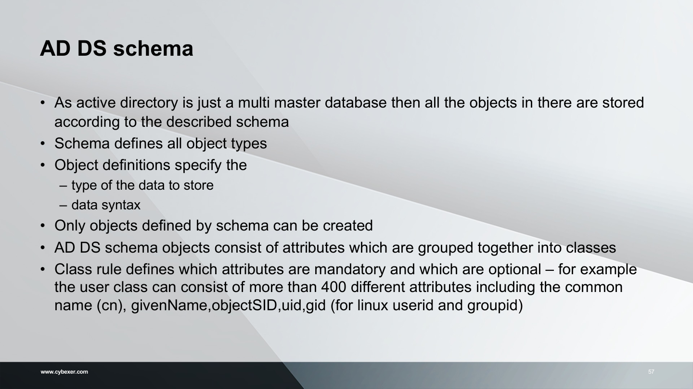

**Схема AD DS (AD DS Schema)**

- Схема визначає всі типи об'єктів і синтаксис даних
- Об'єкти схеми AD DS складаються з атрибутів (attributes), які групуються в класи (classes)
- Клас користувача (user class) може складатися з більш ніж 400 різних атрибутів

---

## Сторінка 58

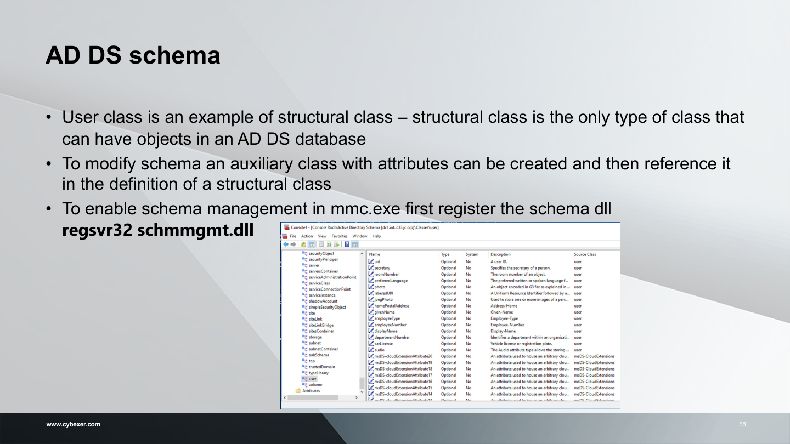

**Схема AD DS (продовження)**

- Клас користувача (user class) — приклад структурного класу (structural class)
- Для зміни схеми можна створити допоміжний клас (auxiliary class) з атрибутами
- Для ввімкнення управління схемою в `mmc.exe`:

```
regsvr32 schmmgmt.dll
```

---

## Сторінка 59

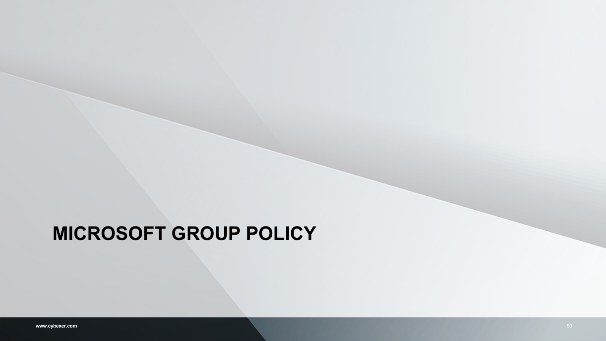

# ГРУПОВА ПОЛІТИКА MICROSOFT (Microsoft Group Policy)

---

## Сторінка 60

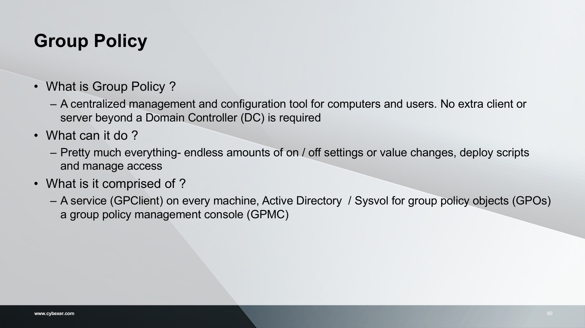

**Групова політика (Group Policy)**

**Що таке Group Policy?** Централізований інструмент управління та налаштування комп'ютерів і користувачів. Не потребує додаткового клієнта чи сервера, крім контролера домену (DC).

**Що вона може робити?** Практично все: нескінченна кількість параметрів, розгортання скриптів та управління доступом.

**З чого вона складається?** Служба (GPClient) на кожній машині, Active Directory / Sysvol для GPOs, консоль управління груповою політикою (GPMC).

---

## Сторінка 61

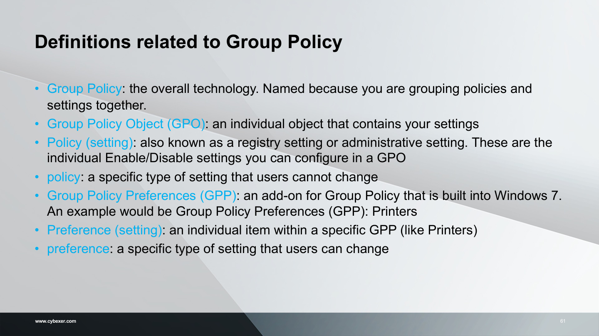

**Визначення, пов'язані з груповою політикою (Definitions Related to Group Policy)**

- **Group Policy** — загальна технологія
- **Group Policy Object (GPO)** — окремий об'єкт, що містить параметри
- **Policy (setting)** — параметр реєстру (registry setting), що не може бути змінений користувачем
- **Group Policy Preferences (GPP)** — надбудова для Group Policy, вбудована в Windows 7
- **preference** — тип параметра, який користувачі можуть змінити

---

## Сторінка 62

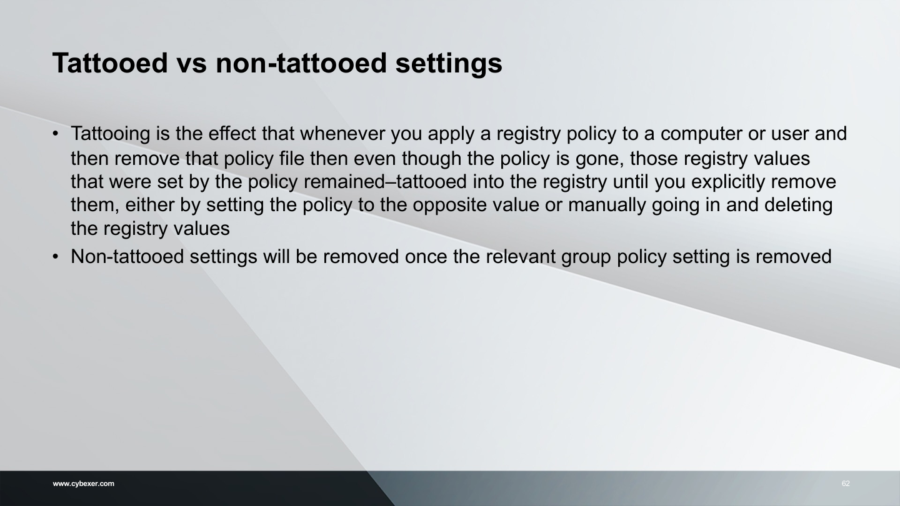

**Параметри з «татуюванням» та без (Tattooed vs Non-Tattooed Settings)**

- **Татуювання (Tattooing)** — ефект, коли значення реєстру (registry values), встановлені політикою, залишаються після видалення політики, поки ви явно не видалите їх
- **Параметри без татуювання (Non-tattooed settings)** — видаляються після видалення відповідного параметра групової політики

---

## Сторінка 63

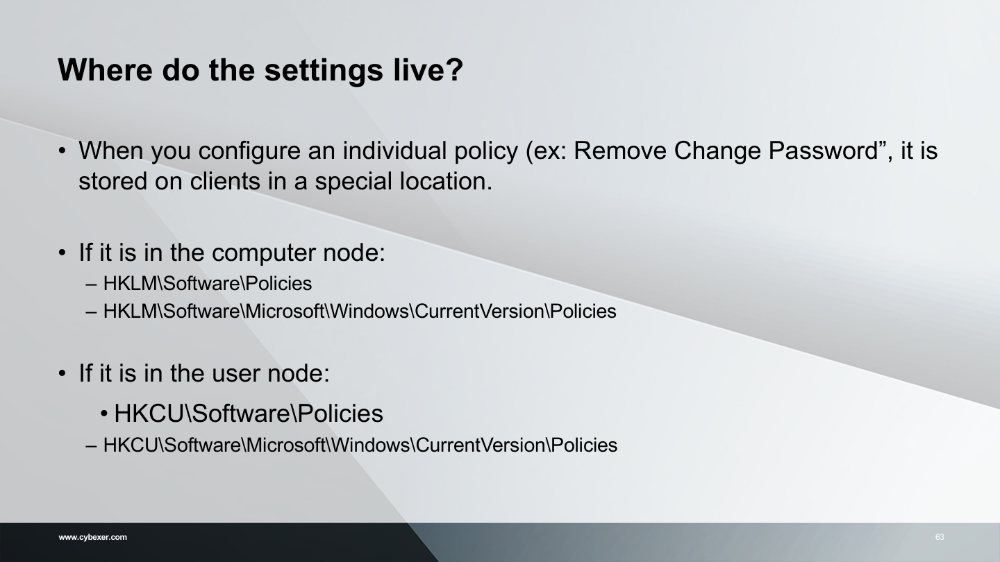

**Де зберігаються параметри? (Where Do the Settings Live?)**

**Якщо в вузлі Computer:**
- `HKLM\Software\Policies`
- `HKLM\Software\Microsoft\Windows\CurrentVersion\Policies`

**Якщо в вузлі User:**
- `HKCU\Software\Policies`
- `HKCU\Software\Microsoft\Windows\CurrentVersion\Policies`

---

## Сторінка 64

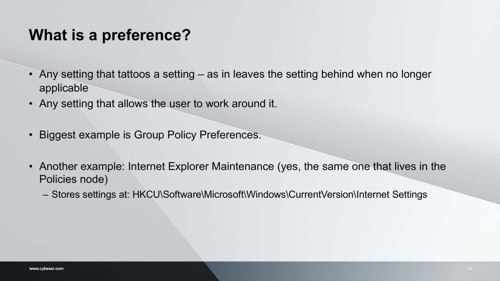

**Що таке preference?**

- Будь-який параметр, що «татуює» значення — залишає параметр після того, як він стає неактуальним
- Будь-який параметр, який дозволяє користувачу його обійти
- Найбільший приклад — Group Policy Preferences
- Internet Explorer Maintenance зберігає параметри в: `HKCU\Software\Microsoft\Windows\CurrentVersion\Internet Settings`

---

## Сторінка 65

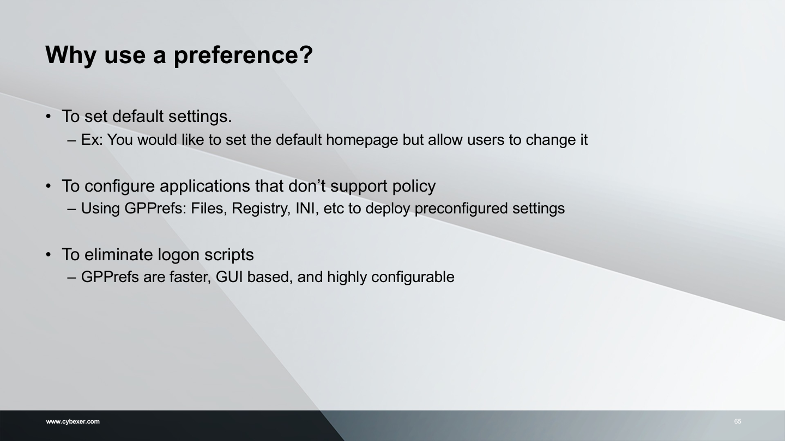

**Навіщо використовувати preference?**

- **Для встановлення параметрів за замовчуванням** — наприклад, домашня сторінка, яку користувач може змінити
- **Для налаштування застосунків, які не підтримують policy** — використання GPPrefs: Files, Registry, INI тощо
- **Для усунення скриптів входу (logon scripts)** — GPPrefs швидші та мають графічний інтерфейс

---

## Сторінка 66

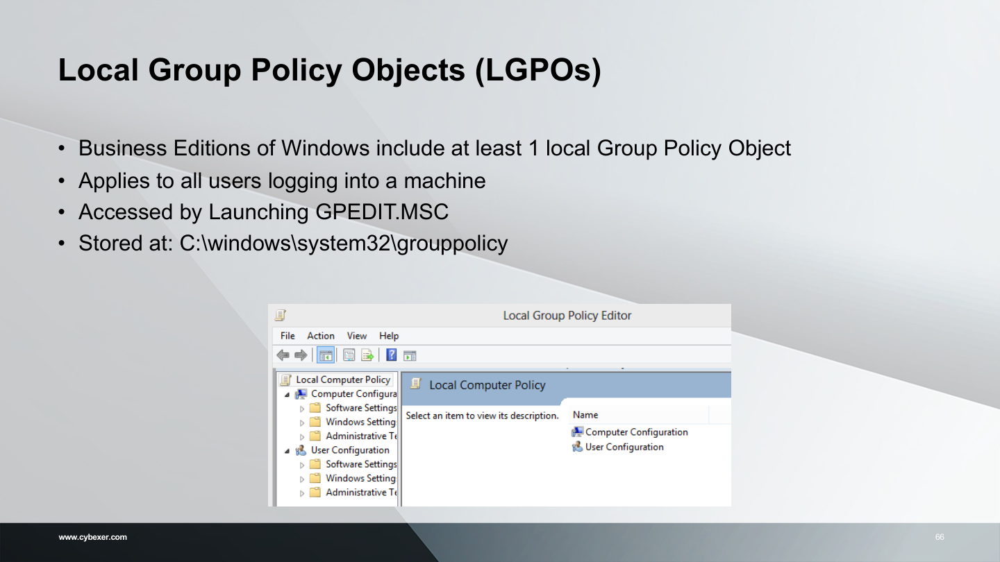

**Локальні об'єкти групової політики (Local Group Policy Objects — LGPOs)**

- Бізнес-видання Windows включають принаймні 1 локальний GPO
- Застосовується до всіх користувачів, що входять на машину
- Доступ через запуск `GPEDIT.MSC`
- Зберігається в: `C:\windows\system32\grouppolicy`

---

## Сторінка 67

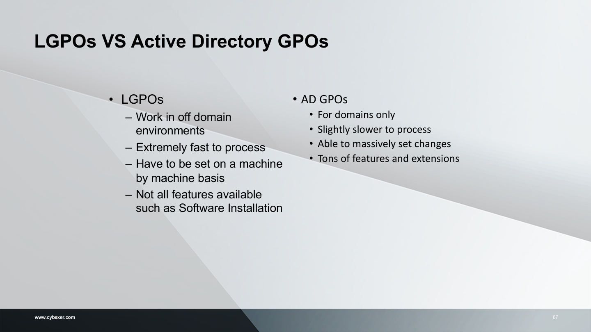

**LGPO проти GPO Active Directory (LGPOs vs Active Directory GPOs)**

| LGPO | AD GPO |
|---|---|
| Працює поза доменом | Тільки для доменів |
| Надзвичайно швидко обробляється | Трохи повільніше |
| Налаштовується на кожній машині окремо | Дозволяє масово вносити зміни |
| Не всі функції доступні | Безліч функцій і розширень |

---

## Сторінка 68

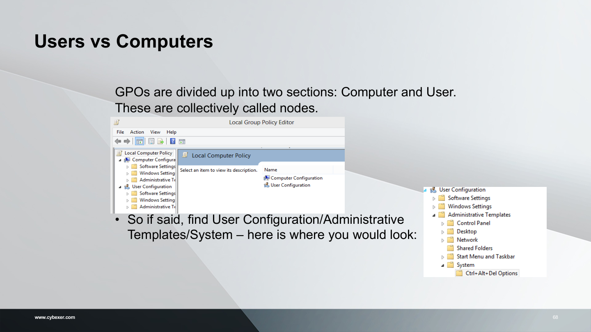

**Користувачі проти Комп'ютерів (Users vs Computers)**

GPO розділені на два вузли (nodes): **Computer** та **User**.

---

## Сторінка 69

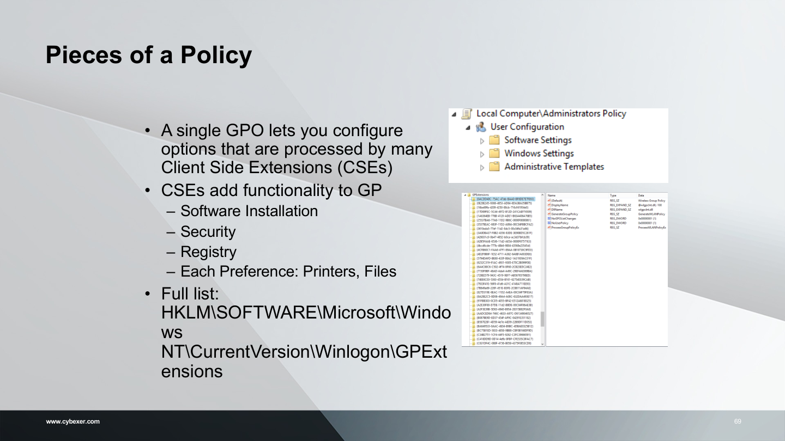

**Складові частини політики (Pieces of a Policy)**

Один GPO дозволяє налаштовувати параметри, що обробляються багатьма розширеннями на стороні клієнта (Client Side Extensions — CSEs):
- Встановлення програмного забезпечення (Software Installation)
- Безпека (Security)
- Реєстр (Registry)
- Кожне Preference: Printers, Files тощо

Повний список: `HKLM\SOFTWARE\Microsoft\Windows NT\CurrentVersion\Winlogon\GPExtensions`

---

## Сторінка 70

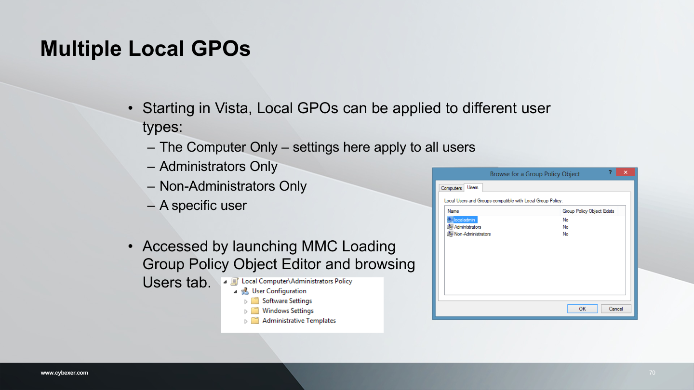

**Кілька локальних GPO (Multiple Local GPOs)**

Починаючи з Vista, локальні GPO можна застосовувати до різних типів користувачів:
- **Computer Only** — параметри для всіх користувачів
- **Administrators Only**
- **Non-Administrators Only**
- **Конкретний користувач (A specific user)**

---

## Сторінка 71

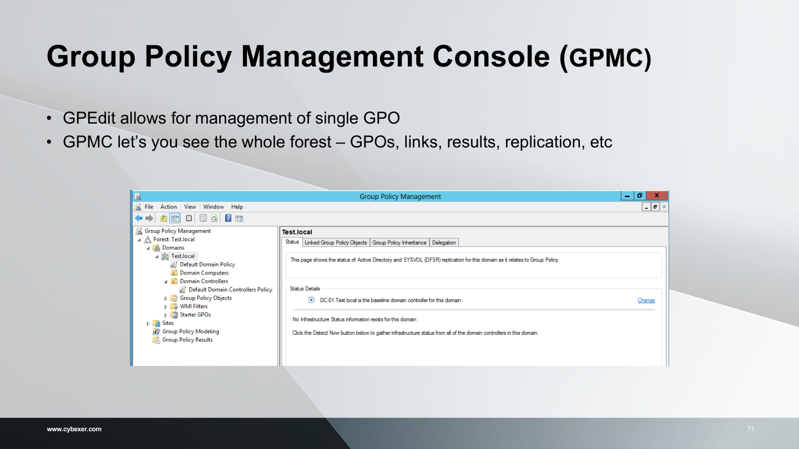

**Консоль управління груповою політикою (Group Policy Management Console — GPMC)**

- **GPEdit** — управління одним GPO
- **GPMC** — перегляд всього лісу: GPO, прив'язки, результати, реплікація тощо

---

## Сторінка 72

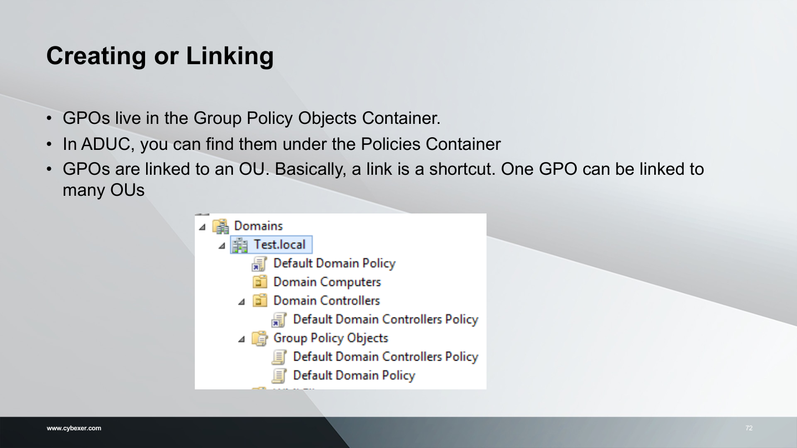

**Створення або прив'язка (Creating or Linking)**

- GPO зберігаються в контейнері Group Policy Objects
- GPO прив'язуються до OU. Один GPO може бути прив'язаний до багатьох OU

---

## Сторінка 73

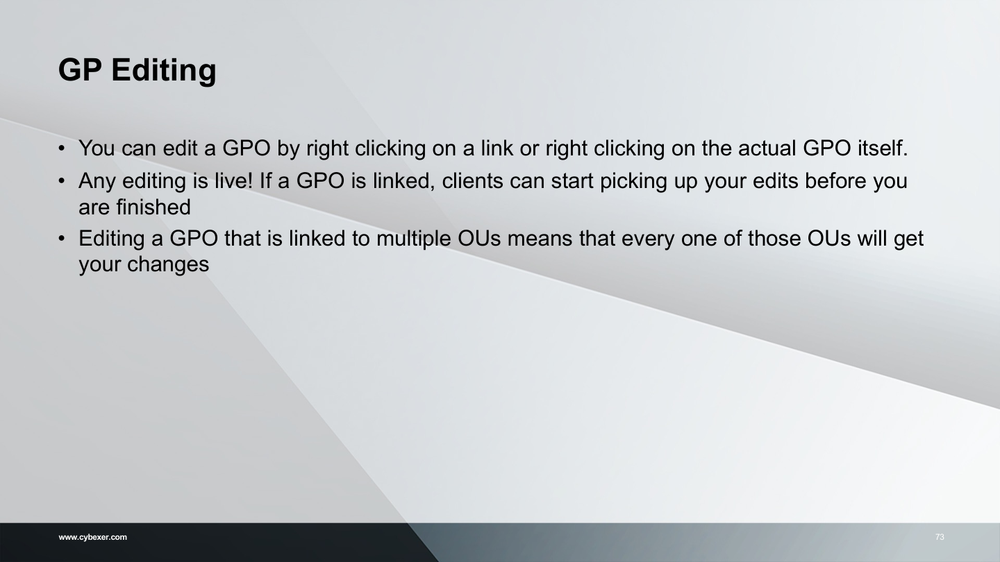

**Редагування GP (GP Editing)**

- Будь-яке редагування відбувається в режимі реального часу! Клієнти можуть починати отримувати зміни ще до завершення редагування
- Редагування GPO, прив'язаного до кількох OU, означає, що всі ці OU отримають зміни

---

## Сторінка 74

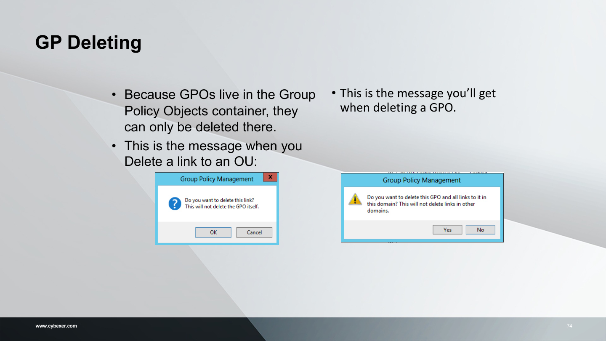

**Видалення GP (GP Deleting)**

- GPO можна видаляти лише з контейнера Group Policy Objects
- При видаленні прив'язки та при видаленні самого GPO виводяться різні повідомлення

---

## Сторінка 75

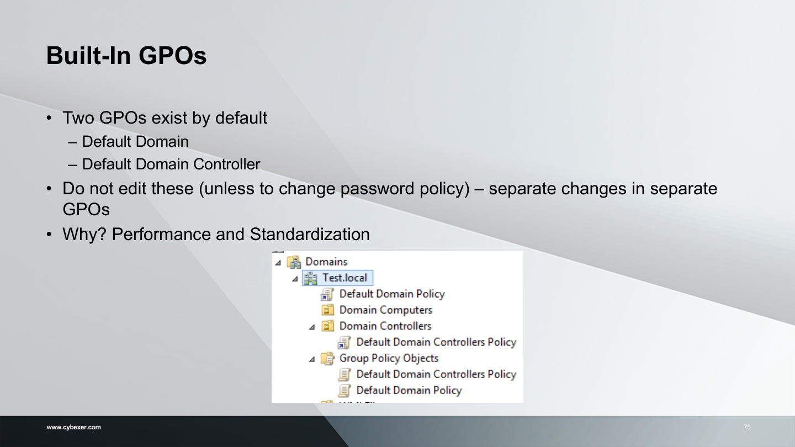

**Вбудовані GPO (Built-In GPOs)**

За замовчуванням існують два GPO:
- **Default Domain**
- **Default Domain Controller**

**Не редагуйте ці GPO** (окрім змін політики паролів) — вносьте окремі зміни в окремих GPO.

---

## Сторінка 76

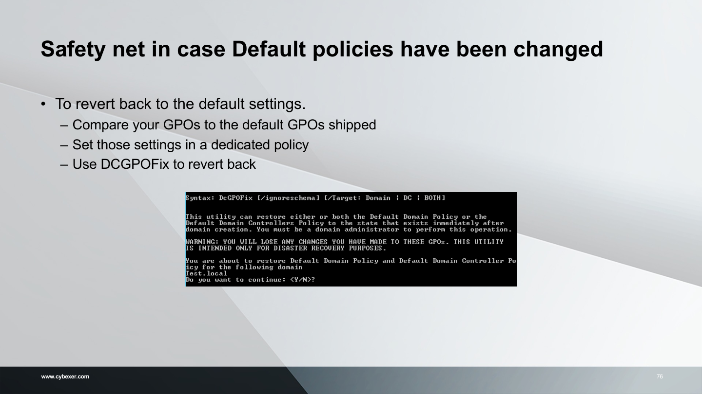

**Страховий механізм (Safety Net)**

Для повернення до стандартних параметрів:
- Порівняйте ваші GPO зі стандартними
- Встановіть параметри в окремій політиці
- Використайте `DCGPOFix` для повернення до стандартних значень

---

## Сторінка 77

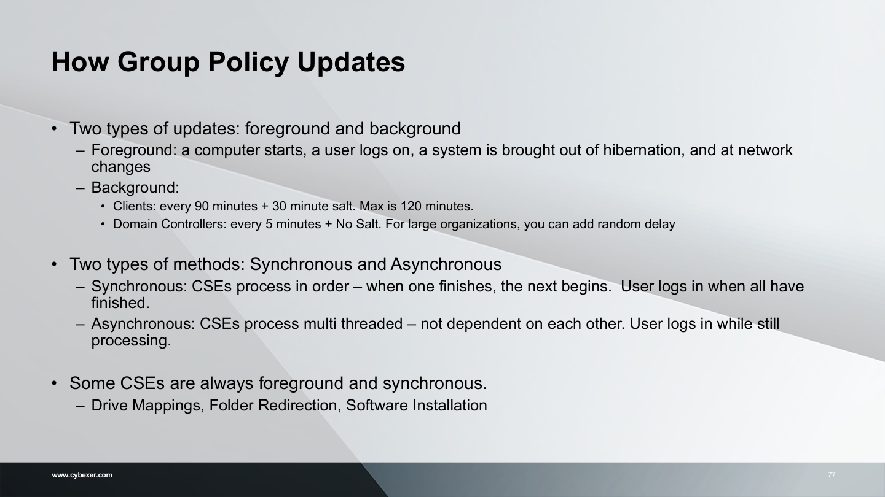

**Як оновлюється Group Policy (How Group Policy Updates)**

**Два типи оновлень:**
- **Foreground:** запуск комп'ютера, вхід користувача, вихід зі стану сну, зміни мережі
- **Background:** клієнти — кожні **90 хв + 30 хв відхилення**; контролери домену — кожні **5 хв**

**Два методи обробки:**
- **Synchronous:** CSE обробляються послідовно — вхід після завершення всіх CSE
- **Asynchronous:** CSE обробляються паралельно — вхід під час обробки

---

## Сторінка 78

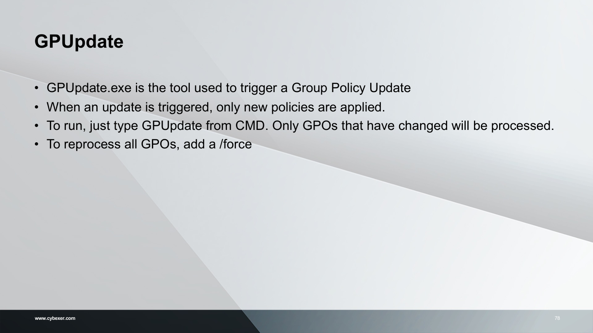

**GPUpdate**

- `GPUpdate.exe` — інструмент для запуску оновлення Group Policy
- Обробляються лише змінені GPO
- Для повторної обробки всіх GPO: `GPUpdate /force`

---

## Сторінка 79

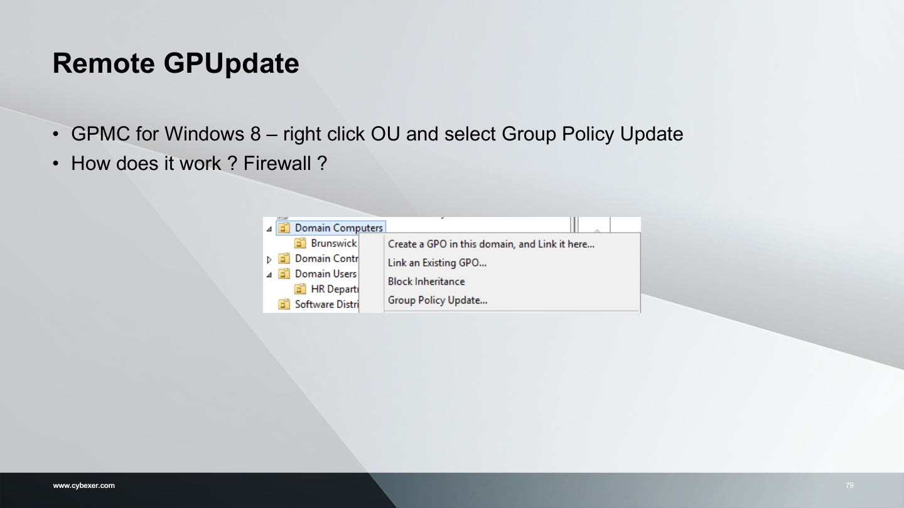

**Віддалений GPUpdate (Remote GPUpdate)**

- GPMC для Windows 8 — клацніть правою кнопкою на OU та виберіть «Group Policy Update»

---

## Сторінка 80

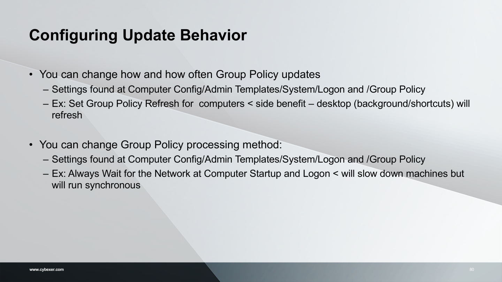

**Налаштування поведінки оновлення (Configuring Update Behavior)**

Параметри знаходяться в: `Computer Config / Admin Templates / System / Logon` та `/Group Policy`

---

## Сторінка 81

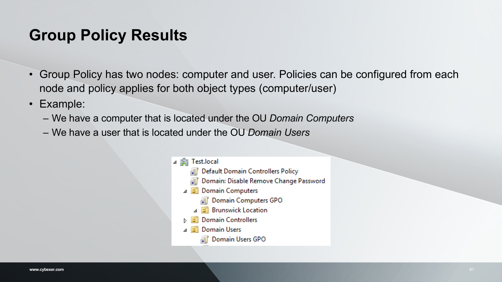

**Результати Group Policy (Group Policy Results)**

Group Policy має два вузли: computer та user. Приклад:
- Комп'ютер знаходиться під OU «Domain Computers»
- Користувач знаходиться під OU «Domain Users»

---

## Сторінка 82

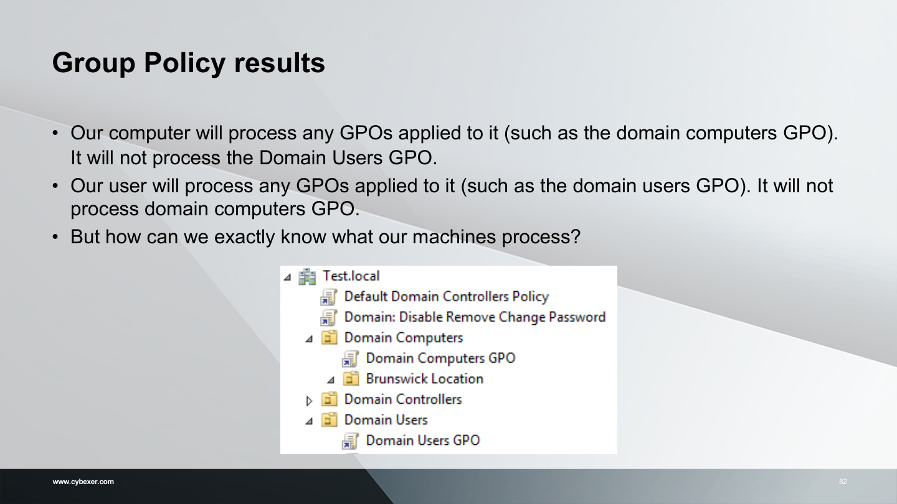

**Результати Group Policy (продовження)**

- Комп'ютер обробляє GPO, застосовані до нього, але не GPO Domain Users
- Користувач обробляє GPO, застосовані до нього, але не GPO Domain Computers

---

## Сторінка 83

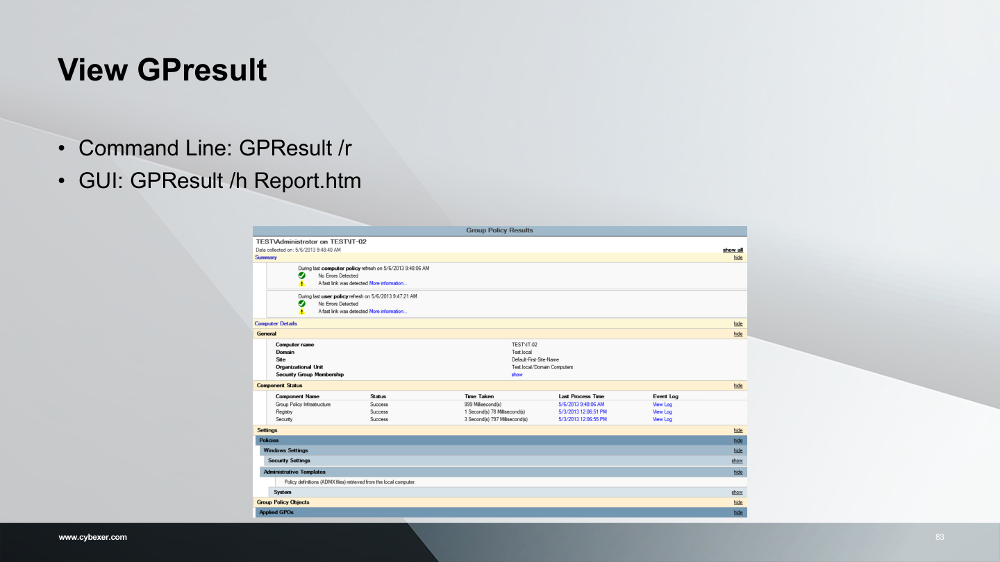

**Перегляд GPresult**

- Командний рядок: `GPResult /r`
- GUI: `GPResult /h Report.htm`

---

## Сторінка 84

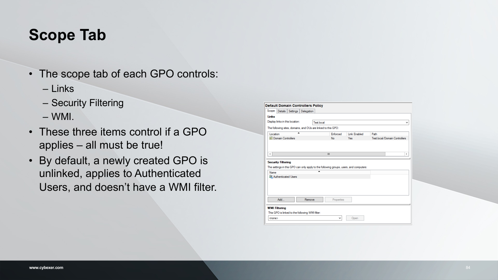

**Вкладка Scope (Область дії)**

Вкладка Scope контролює: **Прив'язки (Links)**, **Фільтрування безпеки (Security Filtering)**, **WMI**. Усі три мають бути вірними для застосування GPO!

---

## Сторінка 85

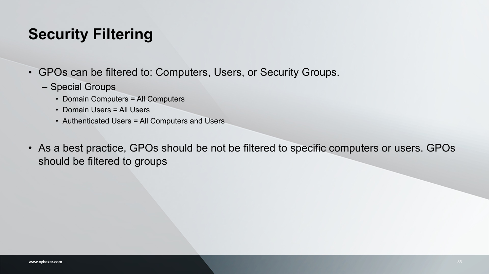

**Фільтрування безпеки (Security Filtering)**

GPO можна фільтрувати для комп'ютерів, користувачів або груп безпеки:
- Domain Computers = Усі комп'ютери
- Domain Users = Усі користувачі
- Authenticated Users = Усі комп'ютери та користувачі

---

## Сторінка 86

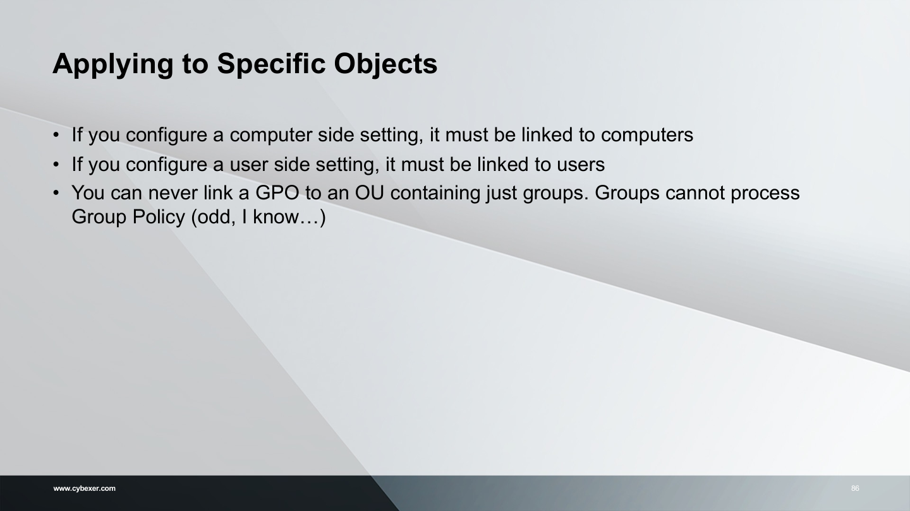

**Застосування до конкретних об'єктів (Applying to Specific Objects)**

- Параметр на стороні комп'ютера — прив'язати до комп'ютерів
- Параметр на стороні користувача — прив'язати до користувачів
- Групи не можуть обробляти Group Policy

---

## Сторінка 87

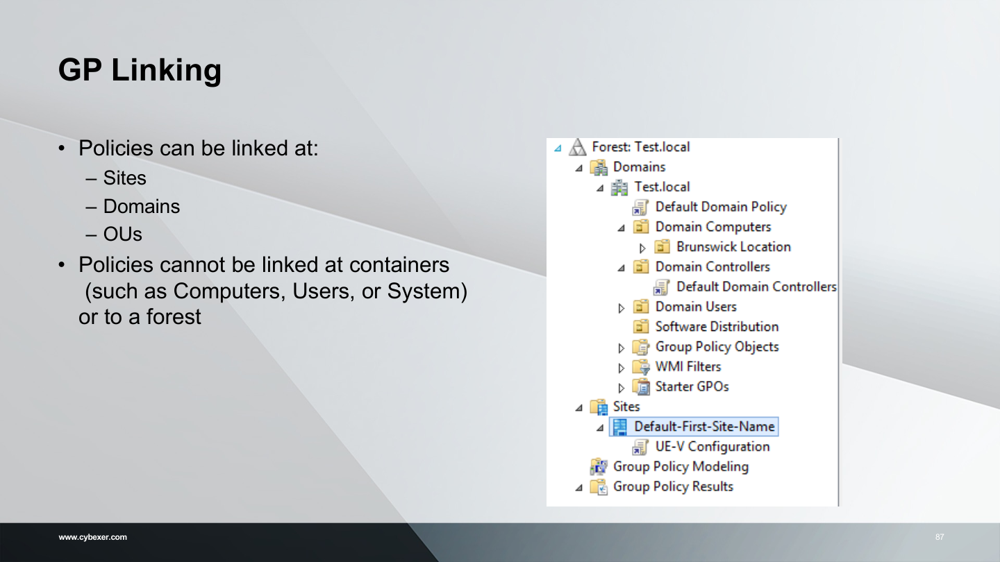

**Прив'язка GP (GP Linking)**

Політики можна прив'язувати до:
- Сайтів (Sites)
- Доменів (Domains)
- OU

Політики **не можна** прив'язати до контейнерів або до лісу.

---

## Сторінка 88

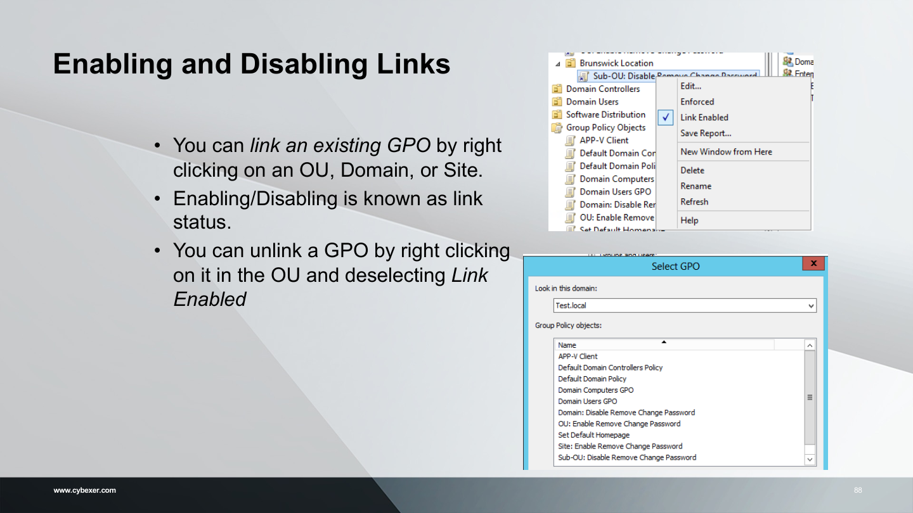

**Увімкнення та вимкнення прив'язок (Enabling and Disabling Links)**

- Прив'язати існуючий GPO: клацніть правою кнопкою на OU, домені або сайті
- Увімкнення/вимкнення — **стан прив'язки (link status)**

---

## Сторінка 89

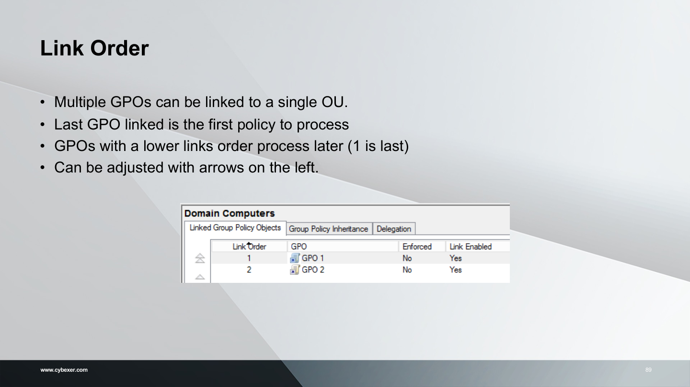

**Порядок прив'язок (Link Order)**

- До одного OU можна прив'язати кілька GPO
- Останній прив'язаний GPO обробляється першим
- GPO з нижчим порядком прив'язок обробляються пізніше (1 — останній)

---

## Сторінка 90

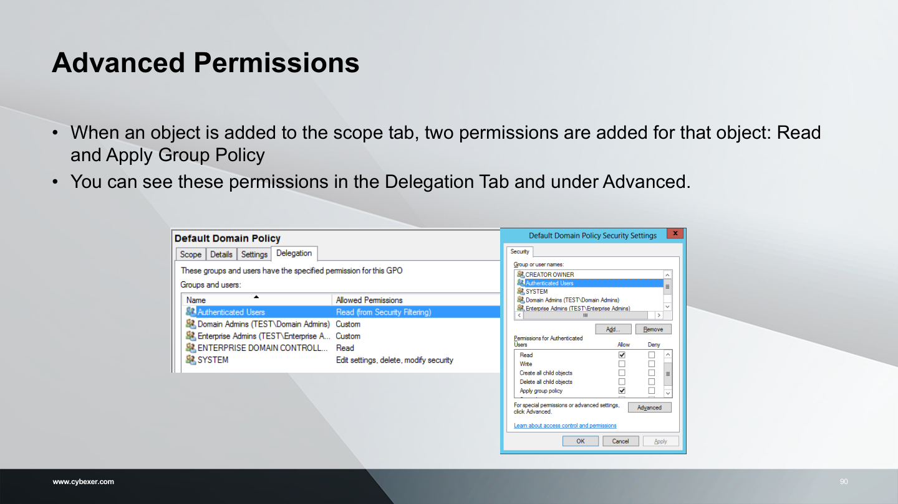

**Розширені дозволи (Advanced Permissions)**

При додаванні об'єкта до Scope для нього додаються два дозволи: **Read** та **Apply Group Policy**.

---

## Сторінка 91

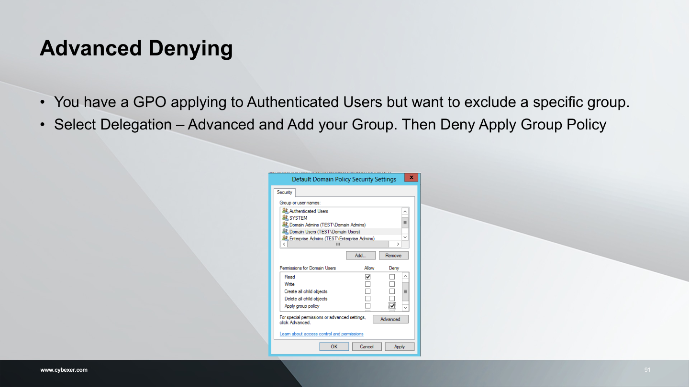

**Розширена заборона (Advanced Denying)**

Щоб виключити певну групу з GPO, що застосовується до Authenticated Users: Delegation → Advanced → Додати групу → Deny «Apply Group Policy».

---

## Сторінка 92

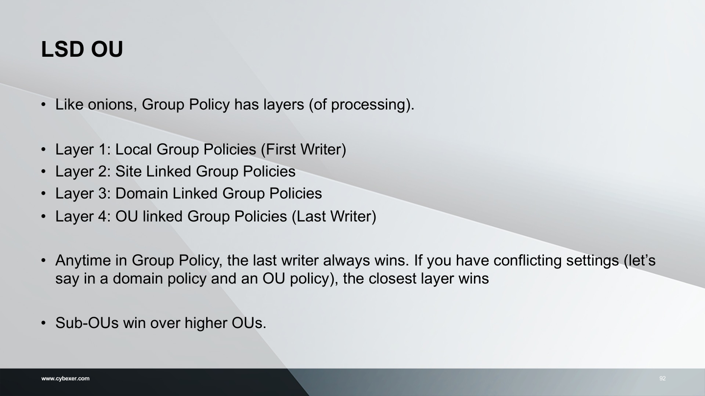

**LSD OU — шари обробки**

- **Шар 1:** Локальні групові політики (Local) — перший запис
- **Шар 2:** Прив'язані до сайту (Site)
- **Шар 3:** Прив'язані до домену (Domain)
- **Шар 4:** Прив'язані до OU (Last Writer — останній запис)

Завжди перемагає **останній запис**. Під-OU перемагають над вищими OU.

---

## Сторінка 93

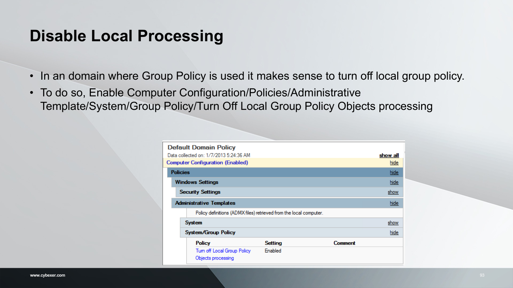

**Вимкнення локальної обробки (Disable Local Processing)**

`Computer Configuration / Policies / Administrative Template / System / Group Policy / Turn Off Local Group Policy Objects processing`

---

## Сторінка 94

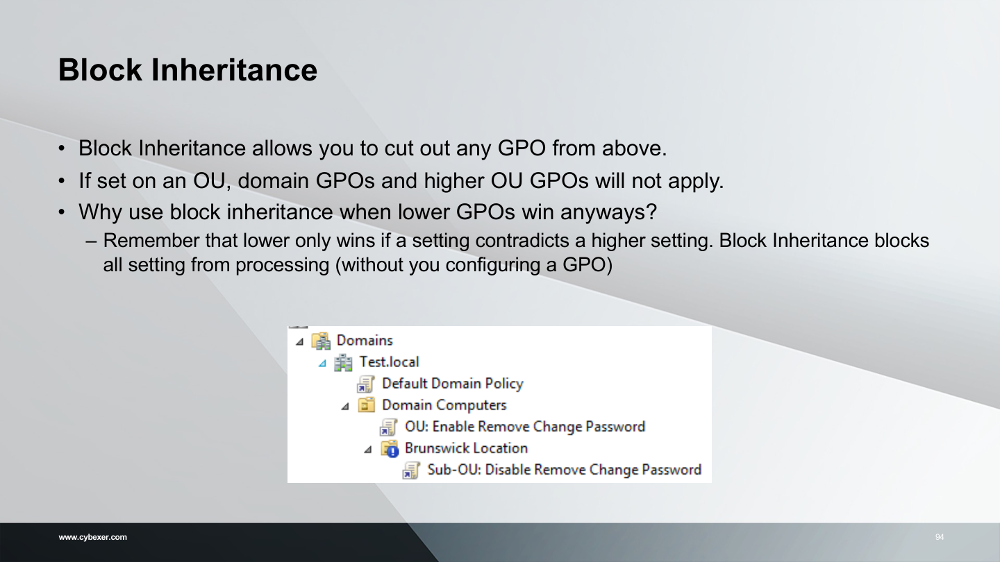

**Блокування успадкування (Block Inheritance)**

- Дозволяє відрізати будь-який GPO, що надходить зверху
- При встановленні на OU — GPO домену та вищих OU не застосовуватимуться

---

## Сторінка 95

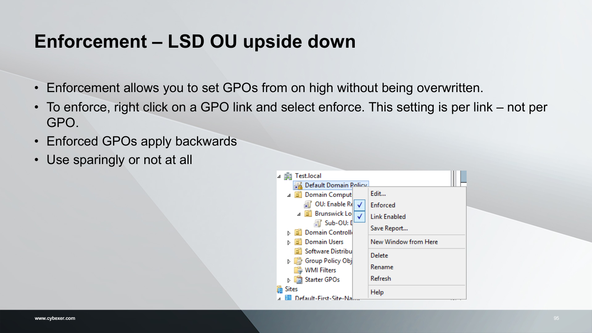

**Примусове застосування (Enforcement)**

- Дозволяє встановлювати GPO «з висоти» без можливості перезапису
- Цей параметр діє **per link** (на прив'язку), а не на GPO
- Використовуйте рідко або взагалі не використовуйте

---

## Сторінка 96

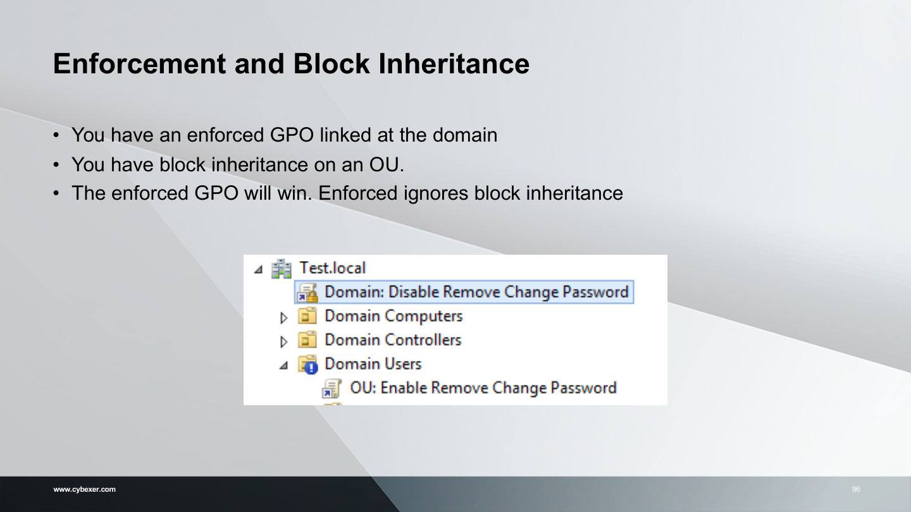

**Enforcement та Block Inheritance**

Якщо є примусовий (enforced) GPO і Block Inheritance на OU — **примусовий GPO переможе**. Enforcement ігнорує Block Inheritance.

---

## Сторінка 97

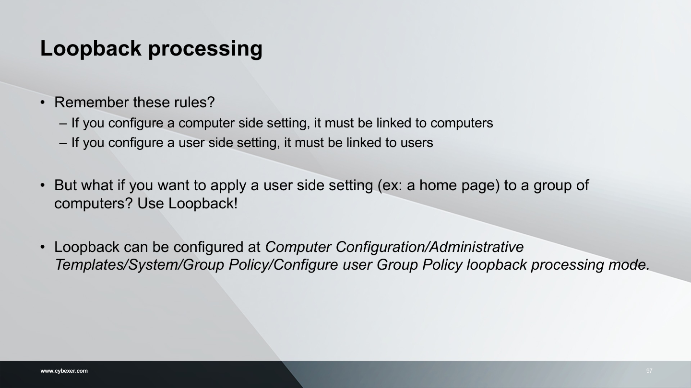

**Зворотна обробка (Loopback Processing)**

Якщо потрібно застосувати параметр на стороні користувача до групи комп'ютерів — використовуйте **Loopback**!

`Computer Configuration / Administrative Templates / System / Group Policy / Configure user Group Policy loopback processing mode`

---

## Сторінка 98

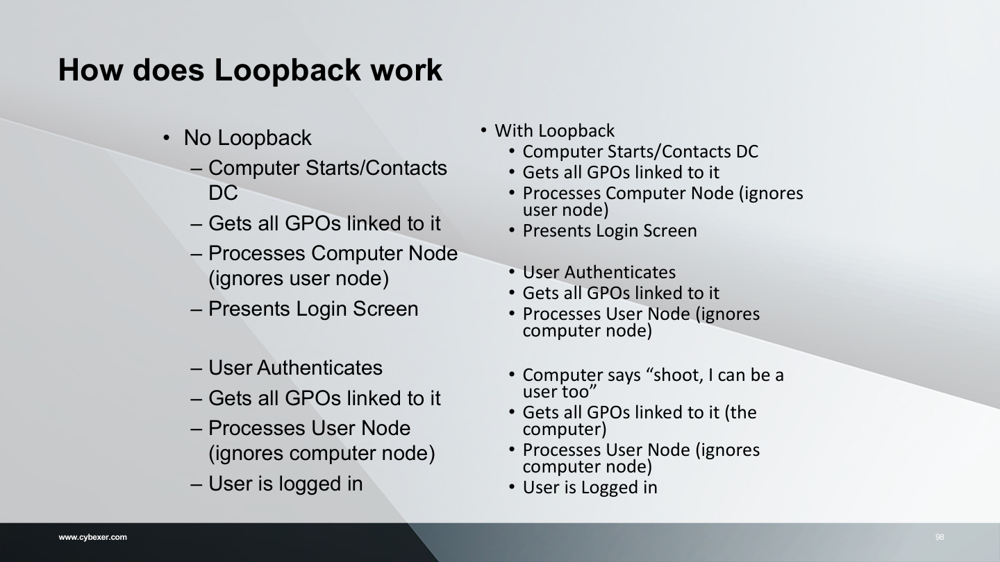

**Як працює Loopback (How Does Loopback Work)**

**Без Loopback:** комп'ютер обробляє вузол Computer → користувач обробляє вузол User.

**З Loopback:** додатково — комп'ютер також обробляє вузол User для своїх GPO.

---

## Сторінка 99

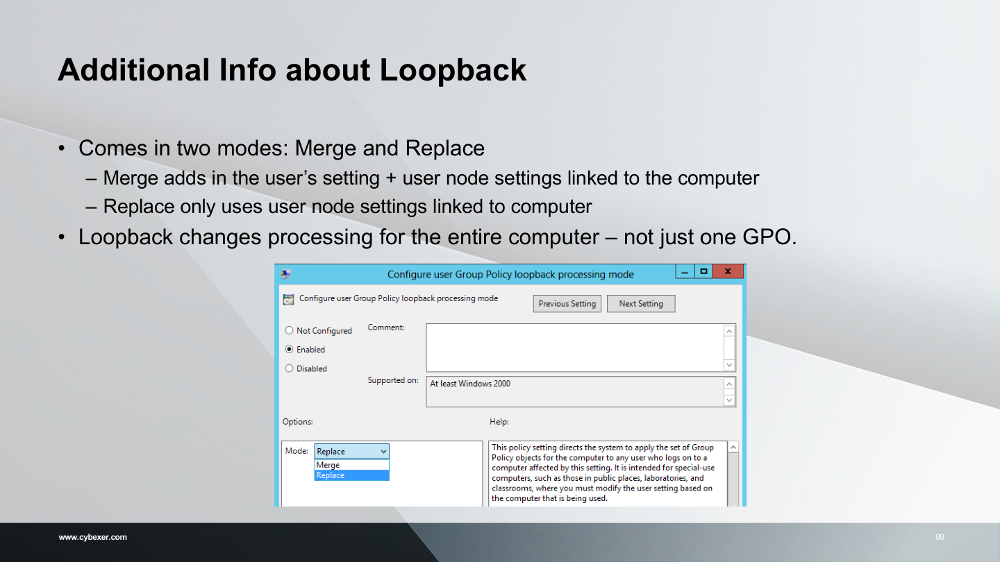

**Додаткова інформація про Loopback**

Два режими:
- **Merge** — додає параметри користувача + параметри вузла User комп'ютера
- **Replace** — використовує лише параметри вузла User комп'ютера

---

## Сторінка 100

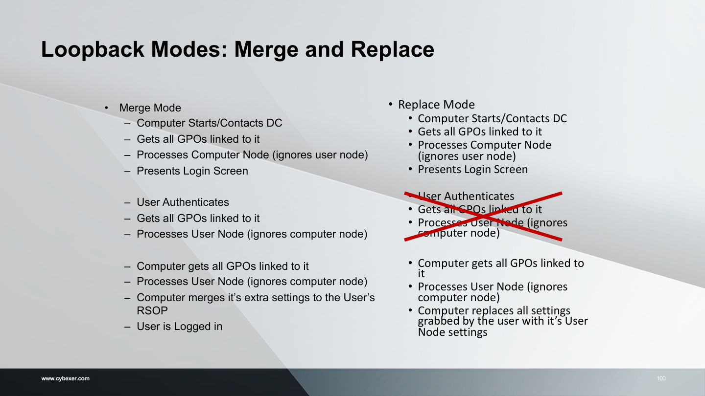

**Режими Loopback: Merge та Replace**

**Merge Mode:** зливає параметри користувача з параметрами вузла User комп'ютера.

**Replace Mode:** замінює всі параметри користувача параметрами вузла User комп'ютера.

---

## Сторінка 101

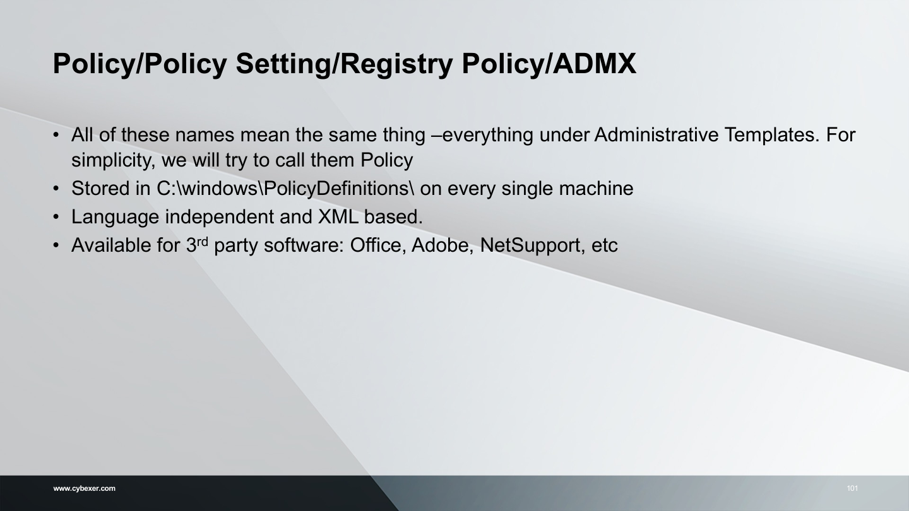

**Policy / Policy Setting / Registry Policy / ADMX**

Усі ці назви означають одне й те ж — все, що знаходиться в розділі Administrative Templates.

- Зберігається в `C:\windows\PolicyDefinitions\` на кожній машині
- Незалежний від мови, базується на XML
- Доступний для стороннього ПЗ: Office, Adobe, NetSupport тощо

---

## Сторінка 102

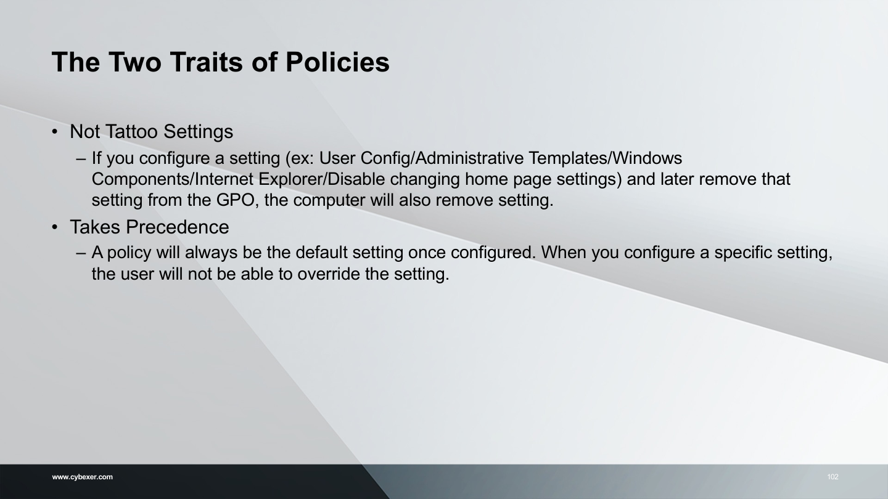

**Дві особливості Policy**

1. **Параметри без татуювання (Not Tattoo Settings)** — при видаленні параметра з GPO комп'ютер також видалить цей параметр
2. **Пріоритет (Takes Precedence)** — Policy завжди матиме пріоритет; користувач не зможе його змінити

---

## Сторінка 103

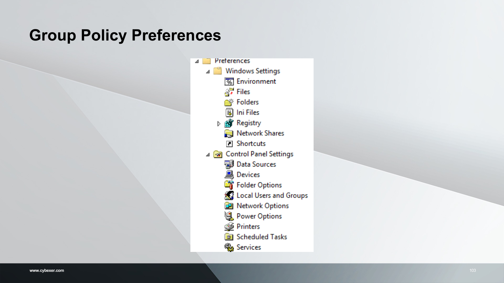

# GROUP POLICY PREFERENCES (Налаштування групової політики)

---

## Сторінка 104

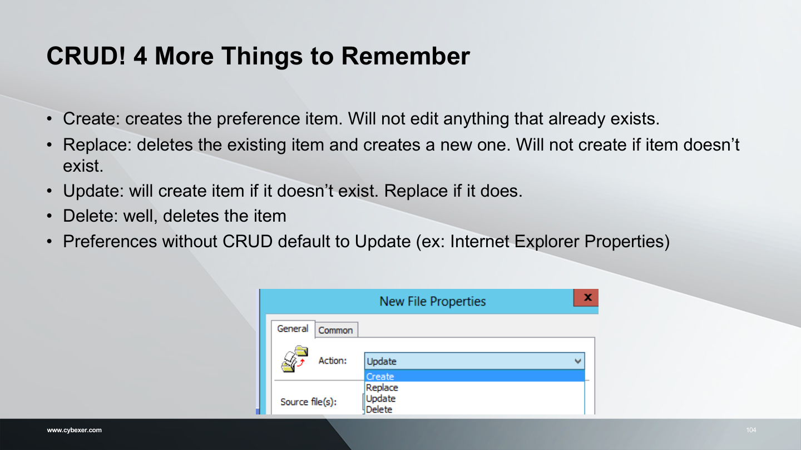

**CRUD! Ще 4 речі для запам'ятовування**

- **Create** — створює елемент preference; не редагує те, що вже існує
- **Replace** — видаляє існуючий елемент і створює новий
- **Update** — створює, якщо не існує; замінює, якщо існує
- **Delete** — видаляє елемент

Preferences без CRUD за замовчуванням використовують **Update**.

---

## Сторінка 105

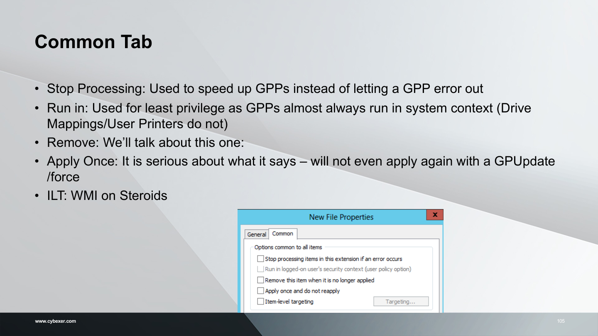

**Вкладка Common (Загальна)**

- **Stop Processing** — прискорює обробку GPP
- **Run in** — для принципу найменших привілеїв (least privilege)
- **Apply Once** — застосовується один раз і не застосовується знову навіть із `GPUpdate /force`
- **ILT** — WMI на стероїдах

---

## Сторінка 106

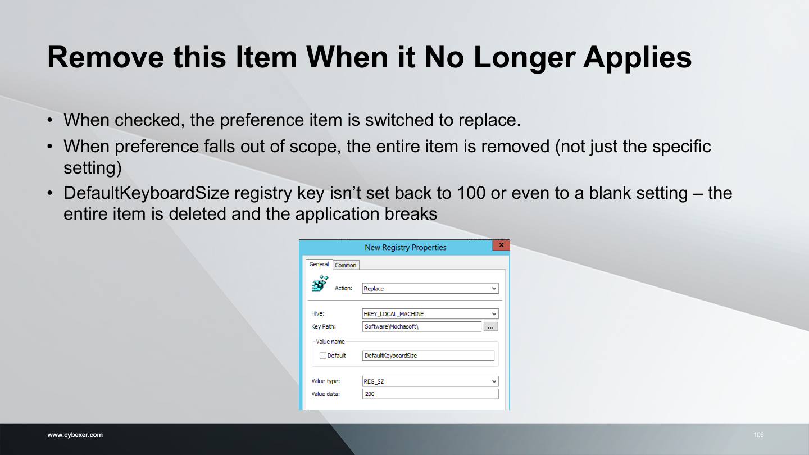

**«Видалити цей елемент, коли він більше не застосовується»**

- Коли позначено, елемент preference перемикається в режим Replace
- Коли preference виходить з області застосування, весь елемент видаляється

---

## Сторінка 107

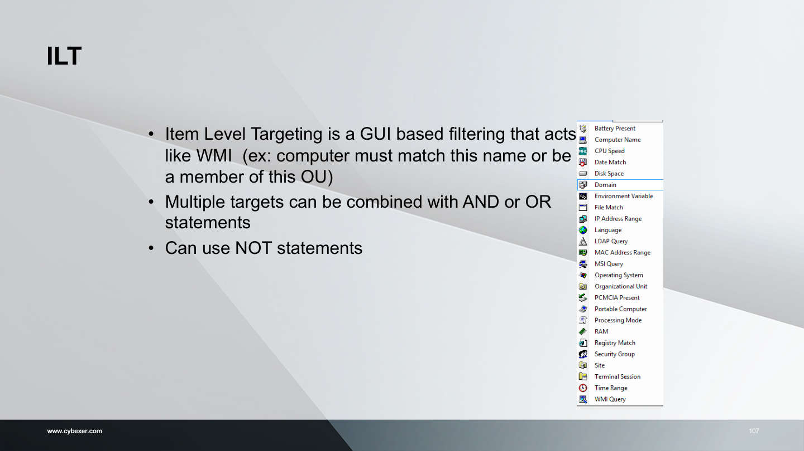

**ILT (Item Level Targeting)**

Фільтрування на основі GUI, яке діє як WMI. Кілька цілей можна комбінувати операторами AND, OR або NOT.

---

## Сторінка 108

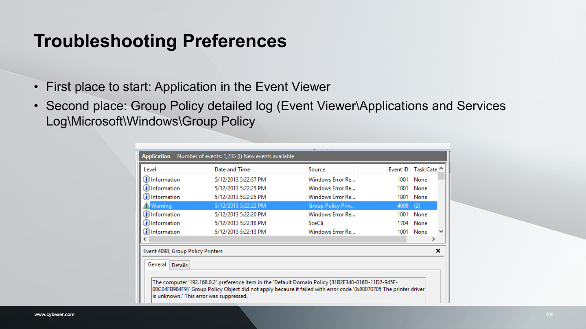

**Усунення несправностей Preferences (Troubleshooting Preferences)**

- Перше місце: Журнал подій (Event Viewer) → Application
- Друге місце: `Event Viewer \ Applications and Services Log \ Microsoft \ Windows \ Group Policy`

---

## Сторінка 109

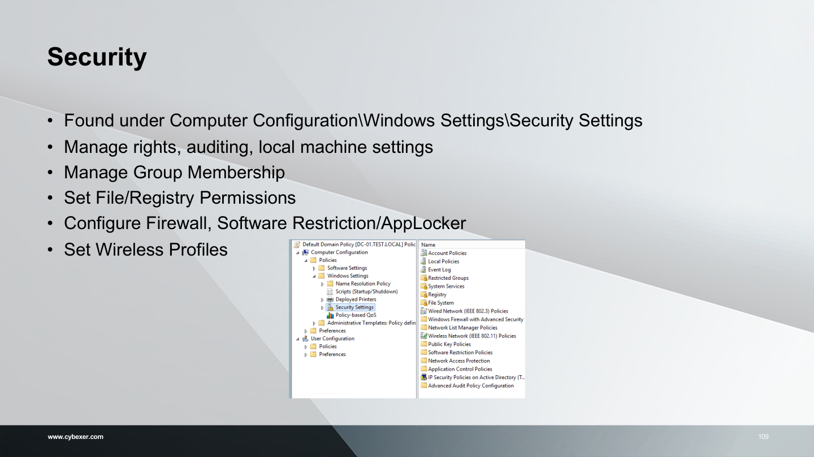

**Безпека (Security)**

`Computer Configuration \ Windows Settings \ Security Settings`

- Управління правами та аудитом
- Управління членством у групах (Group Membership)
- Дозволи на файли/реєстр (File/Registry Permissions)
- Налаштування брандмауера (Firewall), AppLocker
- Профілі бездротових мереж (Wireless Profiles)

---

## Сторінка 110

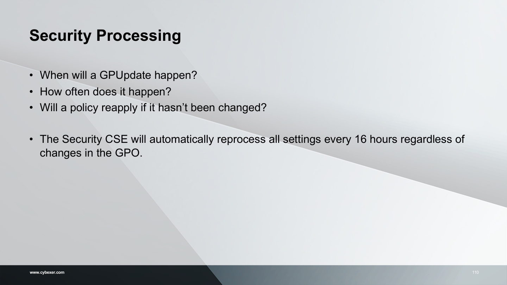

**Обробка безпеки (Security Processing)**

**CSE безпеки автоматично повторно обробляє всі параметри кожні 16 годин** незалежно від змін у GPO.

---

## Сторінка 111

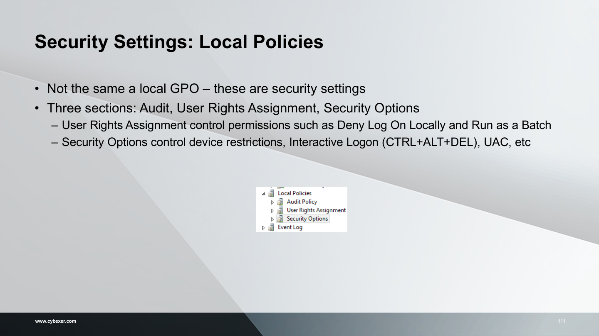

**Параметри безпеки: Локальні політики (Security Settings: Local Policies)**

Три розділи: **Audit**, **User Rights Assignment**, **Security Options**:
- **User Rights Assignment** — дозволи «Deny Log On Locally», «Run as a Batch»
- **Security Options** — обмеження пристроїв, Interactive Logon (CTRL+ALT+DEL), UAC

---

## Сторінка 112


# СКРИПТУВАННЯ (Scripting)

---

## Сторінка 113

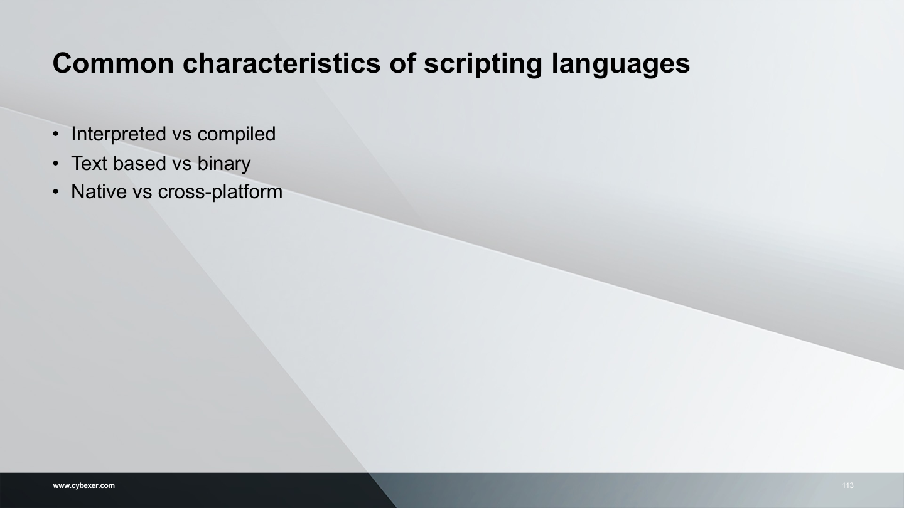

**Загальні характеристики скриптових мов (Common Characteristics of Scripting Languages)**

- Інтерпретовані (Interpreted) проти компільованих (compiled)
- Текстові (Text based) проти бінарних (binary)
- Нативні (Native) проти кросплатформних (cross-platform)

---

## Сторінка 114

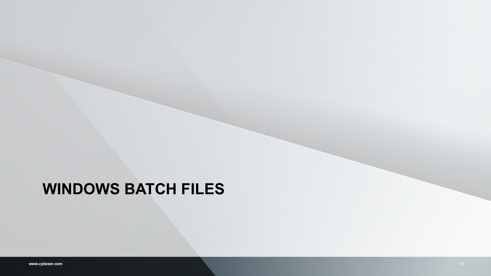

# ПАКЕТНІ ФАЙЛИ WINDOWS (Windows Batch Files)

---

## Сторінка 115

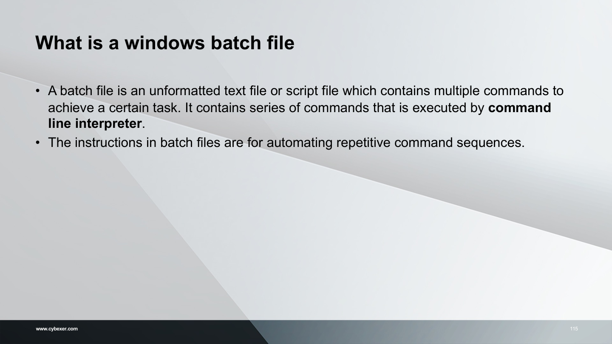

**Що таке пакетний файл Windows? (What Is a Windows Batch File)**

Пакетний файл (batch file) — це неформатований текстовий файл або файл скрипту, що містить кілька команд для виконання певного завдання, які виконуються інтерпретатором командного рядка (command line interpreter).

---

## Сторінка 116

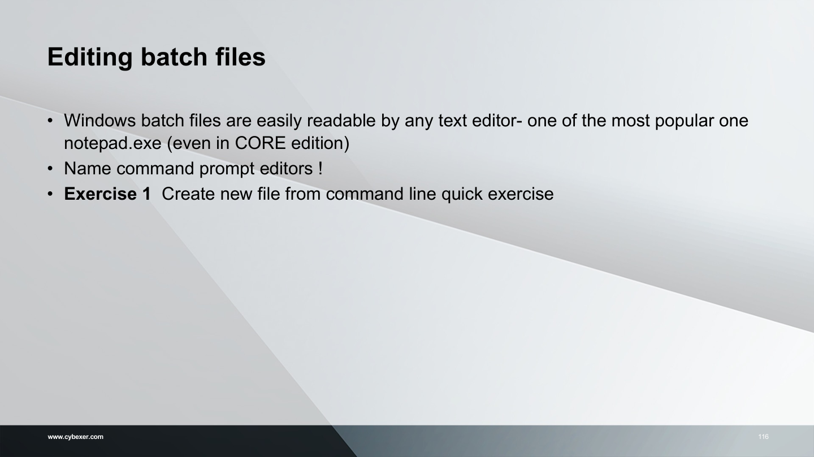

**Редагування пакетних файлів (Editing Batch Files)**

Пакетні файли легко читаються будь-яким текстовим редактором (наприклад, `notepad.exe`).

**Вправа 1:** Створення нового файлу з командного рядка.

---

## Сторінка 117

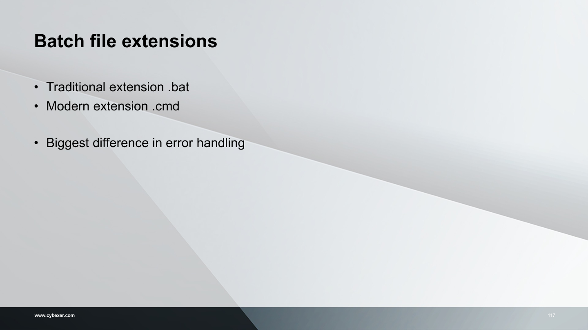

**Розширення пакетних файлів (Batch File Extensions)**

- Традиційне розширення: `.bat`
- Сучасне розширення: `.cmd`
- Найбільша відмінність — в обробці помилок (error handling)

---

## Сторінка 118

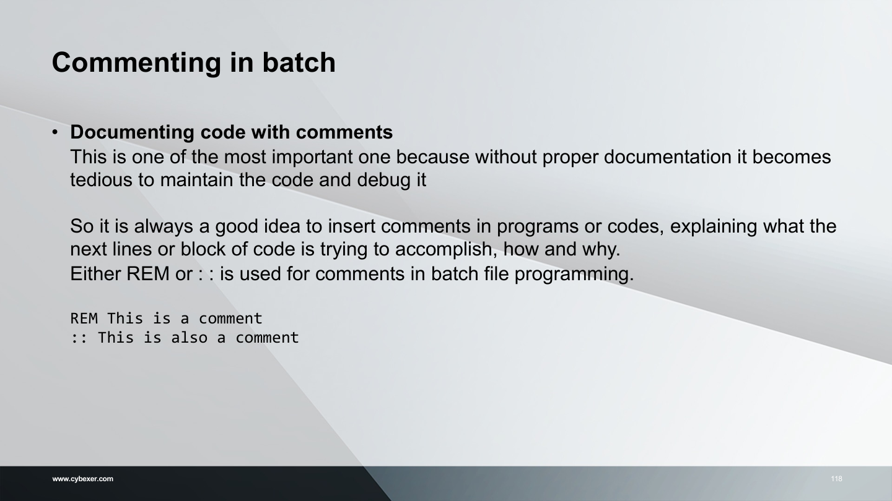

**Коментарі в пакетних файлах (Commenting in Batch)**

```bat
REM Це коментар
:: Це теж коментар
```

---

## Сторінка 119

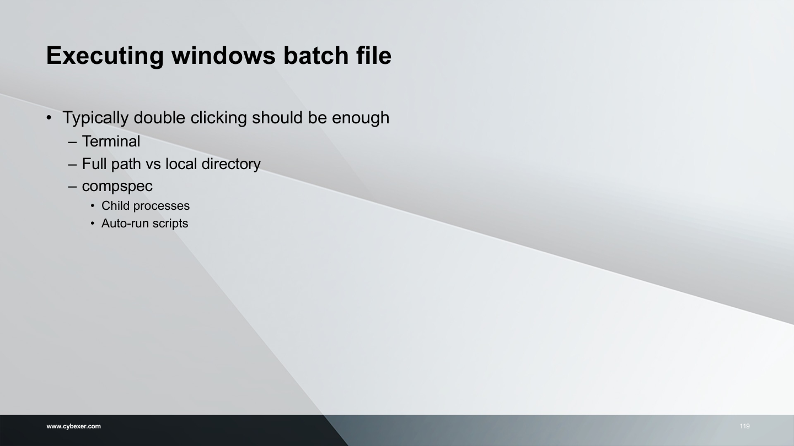

**Виконання пакетного файлу Windows (Executing Windows Batch File)**

- Зазвичай достатньо подвійного кліку
- Дочірні процеси (Child processes)
- Скрипти автозапуску (Auto-run scripts)

---

## Сторінка 120

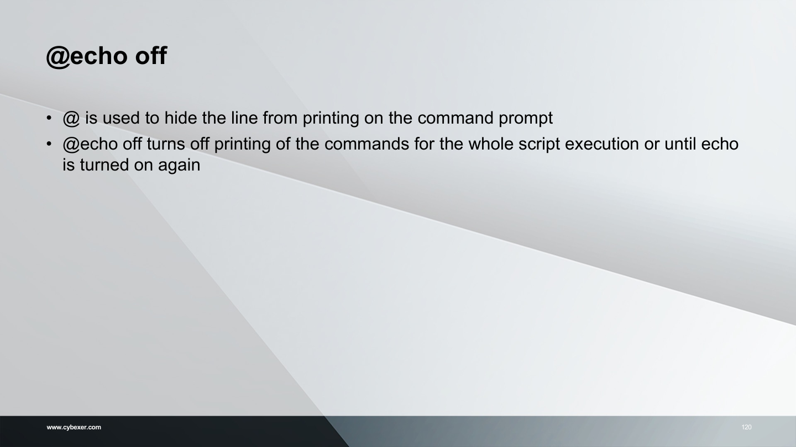

**@echo off**

- `@` — приховує рядок від виведення
- `@echo off` — вимикає виведення команд для всього виконання скрипту

---

## Сторінка 121

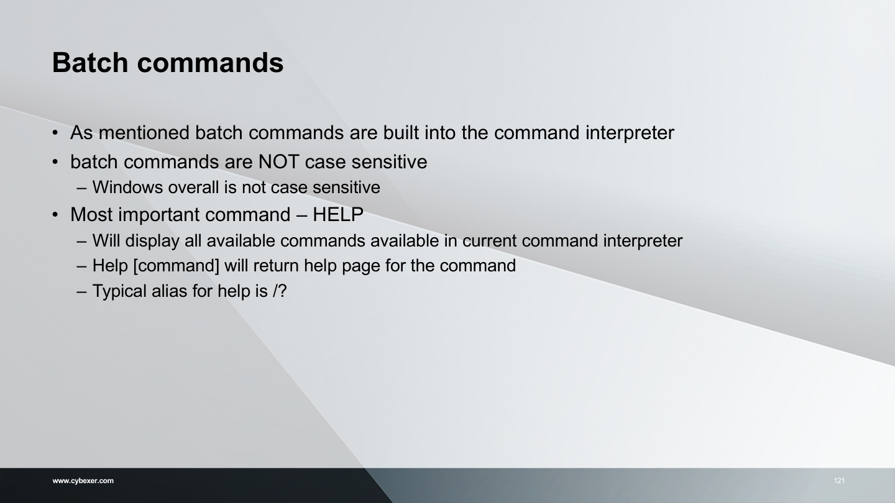

**Команди пакетних файлів (Batch Commands)**

- Команди **НЕ** чутливі до регістру (case sensitive)
- Найважливіша команда — `HELP`
  - `Help [command]` — довідка щодо конкретної команди
  - Типовий псевдонім: `/?`

---

## Сторінка 122

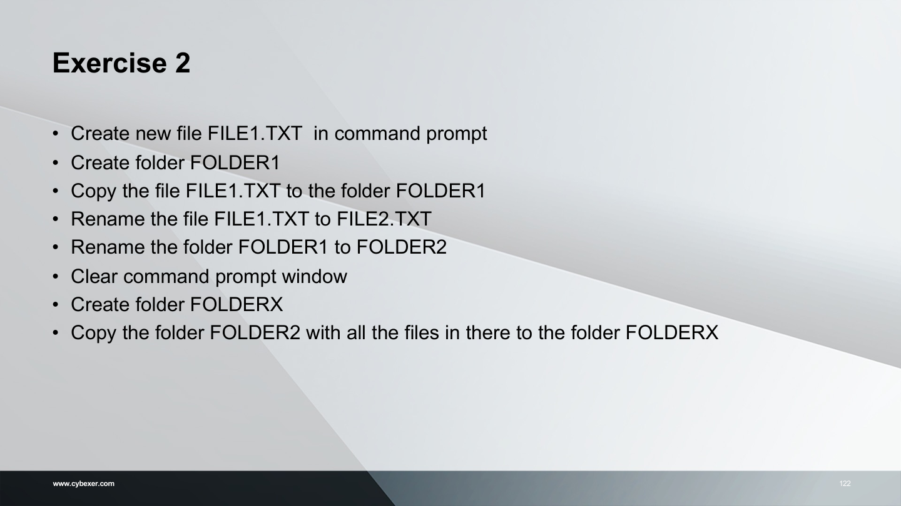

**Вправа 2**

- Створіть `FILE1.TXT` у командному рядку
- Створіть папку `FOLDER1`
- Скопіюйте `FILE1.TXT` до `FOLDER1`
- Перейменуйте `FILE1.TXT` → `FILE2.TXT`
- Перейменуйте `FOLDER1` → `FOLDER2`
- Очистіть вікно командного рядка
- Створіть `FOLDERX` та скопіюйте туди `FOLDER2` з усіма файлами

---

## Сторінка 123

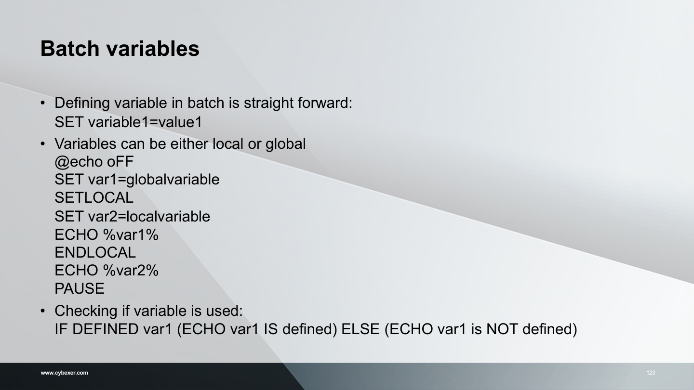

**Змінні пакетних файлів (Batch Variables)**

```bat
SET variable1=value1

@echo oFF
SET var1=globalvariable
SETLOCAL 
SET var2=localvariable
ECHO %var1% 
ENDLOCAL 
ECHO %var2% 
PAUSE

IF DEFINED var1 (ECHO var1 IS defined) ELSE (ECHO var1 is NOT defined)
```

---

## Сторінка 124

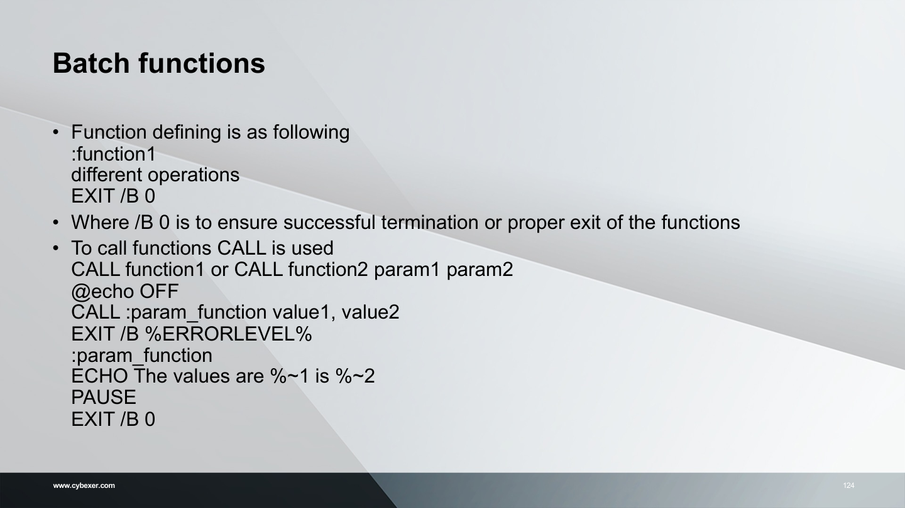

**Функції пакетних файлів (Batch Functions)**

```bat
:function1
different operations
EXIT /B 0

@echo OFF
CALL :param_function value1, value2 
EXIT /B %ERRORLEVEL% 
:param_function
ECHO The values are %~1 is %~2 
PAUSE 
EXIT /B 0
```

---

## Сторінка 125

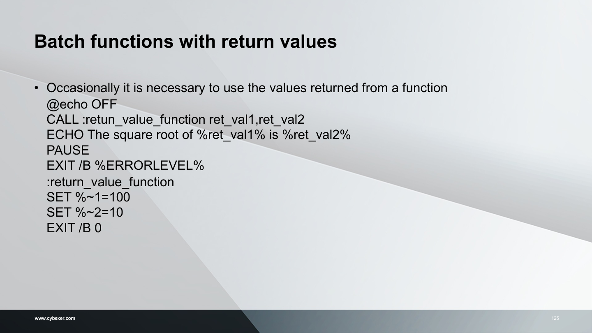

**Функції пакетних файлів із поверненням значень**

```bat
@echo OFF
CALL :retun_value_function ret_val1,ret_val2 
ECHO The square root of %ret_val1% is %ret_val2% 
PAUSE 
EXIT /B %ERRORLEVEL% 
:return_value_function
SET %~1=100 
SET %~2=10 
EXIT /B 0
```

---

## Сторінка 126

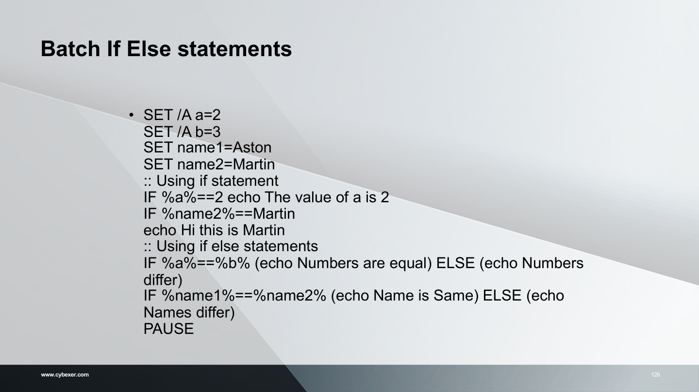

**Умовні оператори If/Else в пакетних файлах**

```bat
SET /A a=2 
SET /A b=3 
IF %a%==2 echo The value of a is 2 
IF %a%==%b% (echo Numbers are equal) ELSE (echo Numbers differ) 
PAUSE
```

---

## Сторінка 127

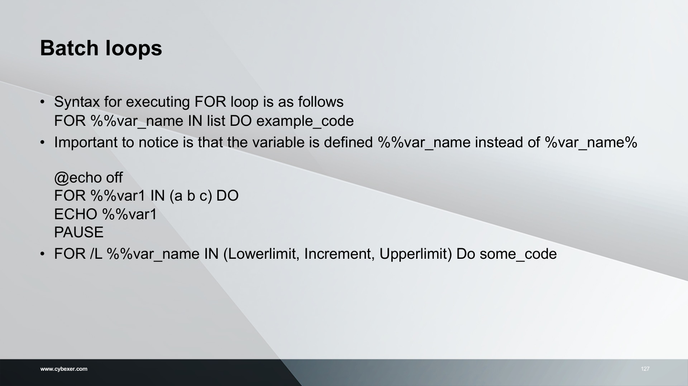

**Цикли пакетних файлів (Batch Loops)**

```bat
FOR %%var_name IN list DO example_code

@echo off
FOR %%var1 IN (a b c) DO ECHO %%var1
PAUSE

FOR /L %%var_name IN (Lowerlimit, Increment, Upperlimit) Do some_code
```

---

## Сторінка 128

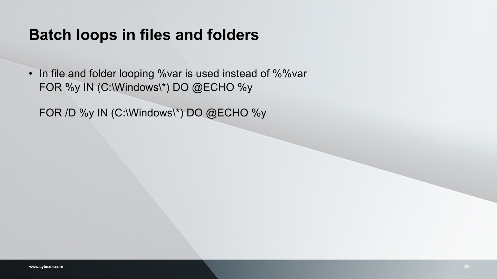

**Цикли пакетних файлів для файлів та папок**

```bat
FOR %y IN (C:\Windows\*) DO @ECHO %y
FOR /D %y IN (C:\Windows\*) DO @ECHO %y
```

---

## Сторінка 129


# ХОСТ СЦЕНАРІЇВ WINDOWS (Windows Scripting Host)

---

## Сторінка 130

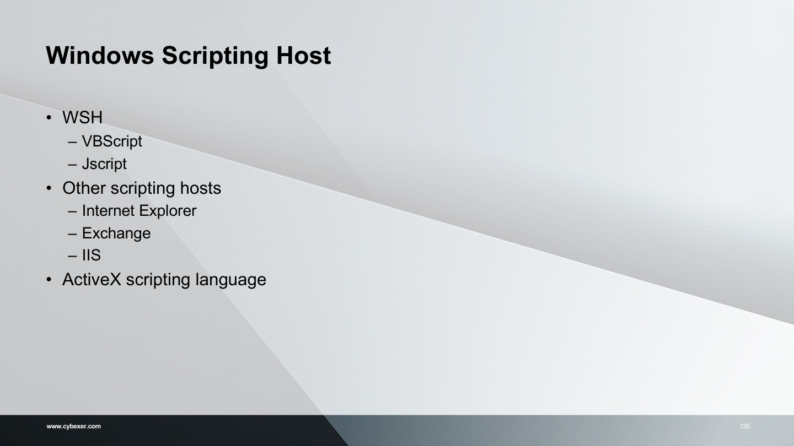

**Windows Scripting Host (WSH)**

- **WSH:** VBScript, JScript
- **Інші хости сценаріїв:** Internet Explorer, Exchange, IIS
- Мова скриптування ActiveX (ActiveX scripting language)

---

## Сторінка 131

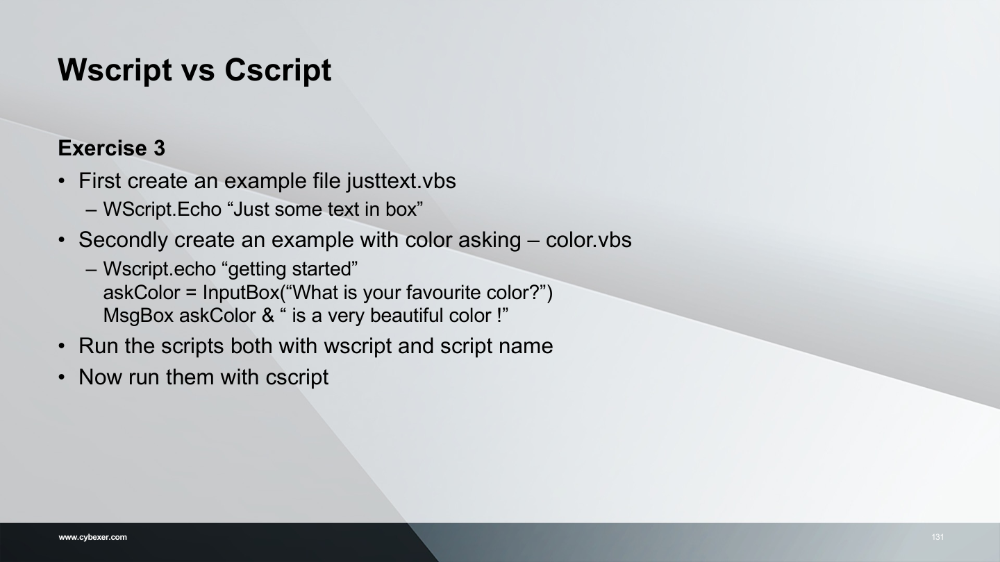

**Wscript проти Cscript — Вправа 3**

```vb
' justtext.vbs
WScript.Echo "Just some text in box"

' color.vbs
Wscript.echo "getting started"
askColor = InputBox("What is your favourite color?") 
MsgBox askColor & " is a very beautiful color !"
```

---

## Сторінка 132

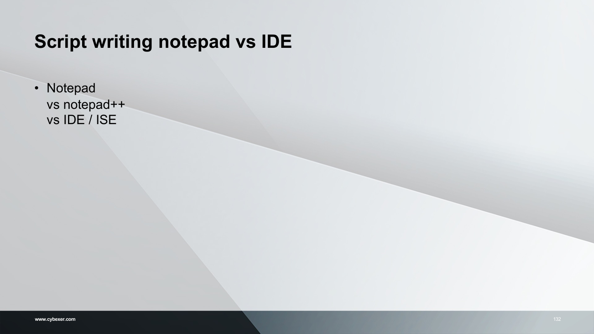

**Написання скриптів: Notepad проти IDE**

- **Notepad** → **Notepad++** → **IDE / ISE**

---

## Сторінка 133

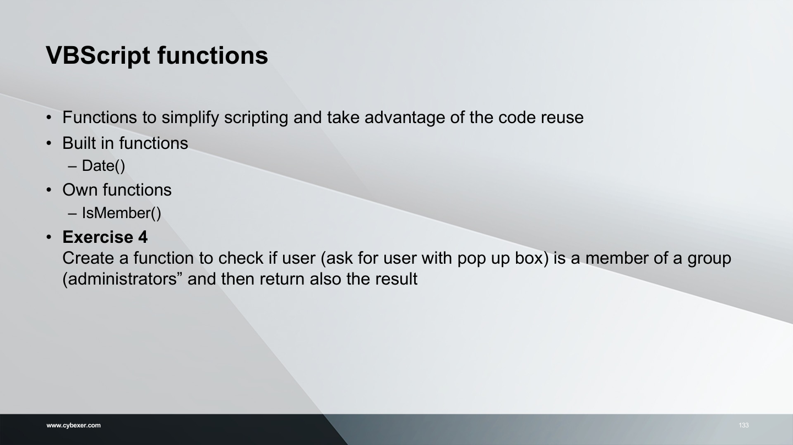

**Функції VBScript**

- Вбудовані: `Date()`
- Власні: `IsMember()`

**Вправа 4:** Створіть функцію для перевірки членства користувача в групі «administrators».

---

## Сторінка 134

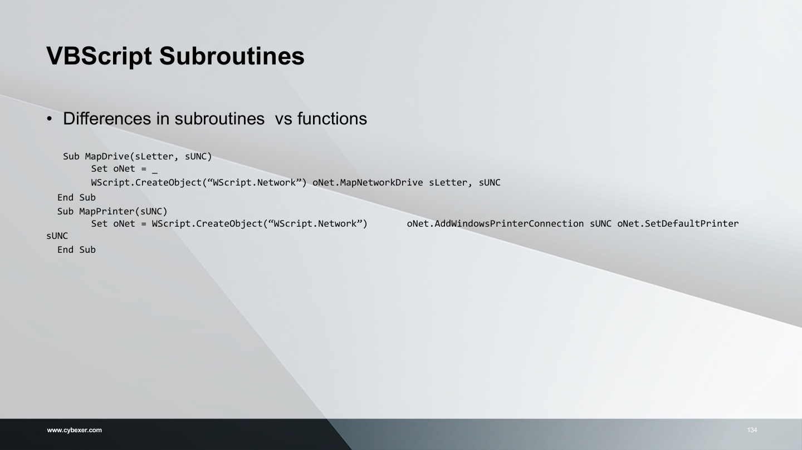

**Підпрограми VBScript (VBScript Subroutines)**

```vb
Sub MapDrive(sLetter, sUNC) 
  Set oNet = WScript.CreateObject("WScript.Network") 
  oNet.MapNetworkDrive sLetter, sUNC
End Sub 

Sub MapPrinter(sUNC)
  Set oNet = WScript.CreateObject("WScript.Network") 
  oNet.AddWindowsPrinterConnection sUNC 
  oNet.SetDefaultPrinter sUNC
End Sub
```

---

## Сторінка 135

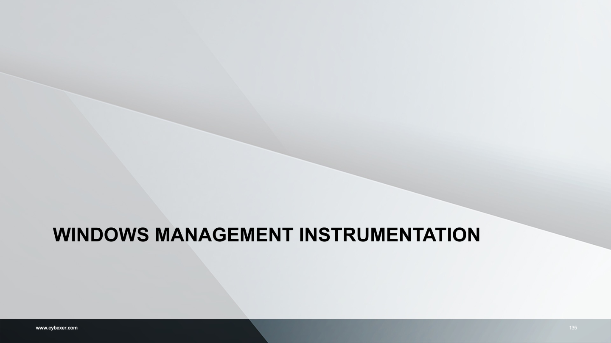

# WINDOWS MANAGEMENT INSTRUMENTATION (WMI)

---

## Сторінка 136

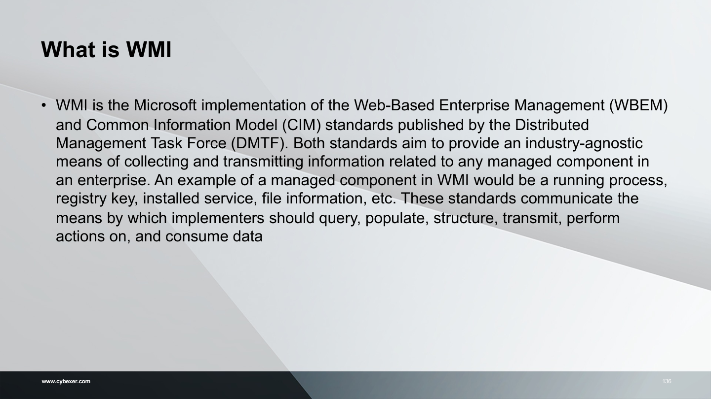

**Що таке WMI? (What Is WMI)**

WMI — реалізація Microsoft стандартів Web-Based Enterprise Management (WBEM) та Common Information Model (CIM). Надає незалежний від платформи засіб збору та передачі інформації про керовані компоненти підприємства (процеси, ключі реєстру, служби, файли тощо).

---

## Сторінка 137

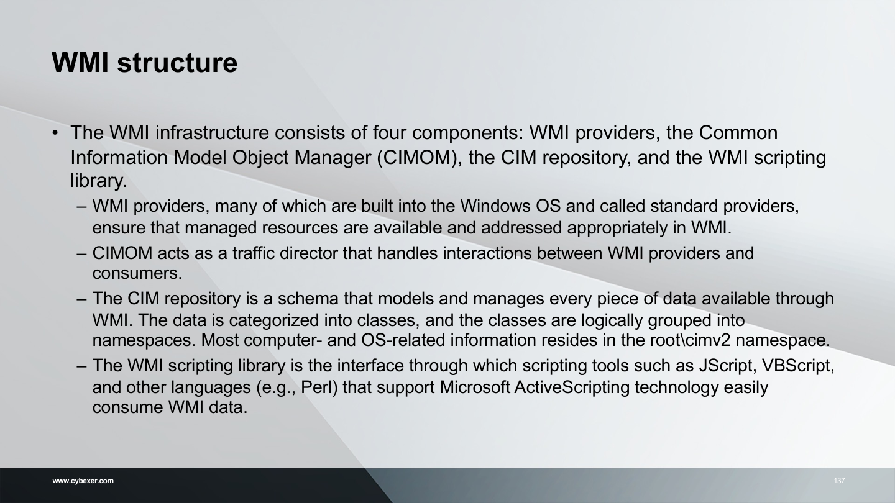

**Структура WMI (WMI Structure)**

Чотири компоненти:
1. **WMI providers** — забезпечують доступність керованих ресурсів
2. **CIMOM** — диспетчер трафіку між постачальниками та споживачами WMI
3. **CIM repository** — схема даних; більшість даних ОС знаходиться в `root\cimv2`
4. **WMI scripting library** — інтерфейс для JScript, VBScript, Perl тощо

---

## Сторінка 138

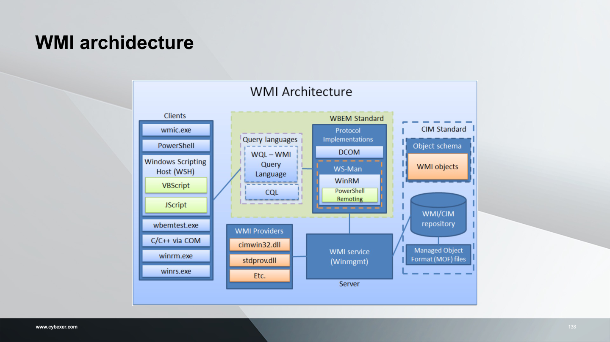

**Архітектура WMI (WMI Architecture)**

*(Схема архітектури WMI)*

---

## Сторінка 139

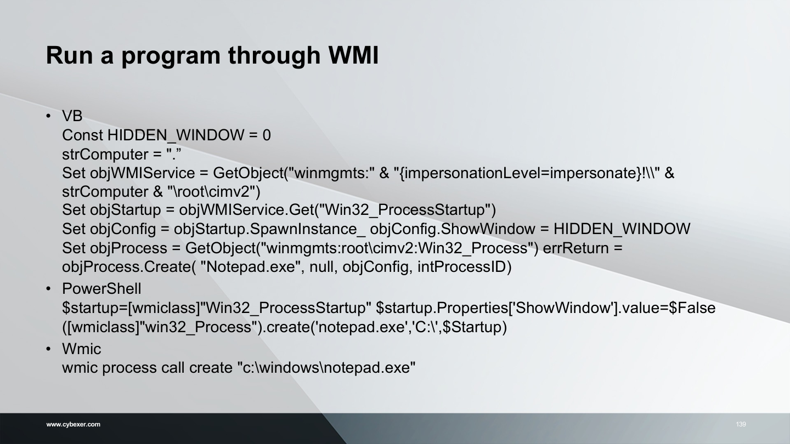

**Запуск програми через WMI (Run a Program Through WMI)**

**VBScript:**
```vb
Const HIDDEN_WINDOW = 0
strComputer = "."
Set objWMIService = GetObject("winmgmts:{impersonationLevel=impersonate}!\\" & strComputer & "\root\cimv2") 
Set objStartup = objWMIService.Get("Win32_ProcessStartup") 
Set objConfig = objStartup.SpawnInstance_
objConfig.ShowWindow = HIDDEN_WINDOW 
Set objProcess = GetObject("winmgmts:root\cimv2:Win32_Process")
errReturn = objProcess.Create("Notepad.exe", null, objConfig, intProcessID)
```

**PowerShell:**
```powershell
$startup=[wmiclass]"Win32_ProcessStartup"
$startup.Properties['ShowWindow'].value=$False 
([wmiclass]"win32_Process").create('notepad.exe','C:\',$Startup)
```

**WMIC:**
```
wmic process call create "c:\windows\notepad.exe"
```

---

## Сторінка 140


**Обговорення (Discussions)**

*(Фінальна сторінка для обговорення)*

---

*Кінець документа. Всього перекладено: 140 сторінок.*
